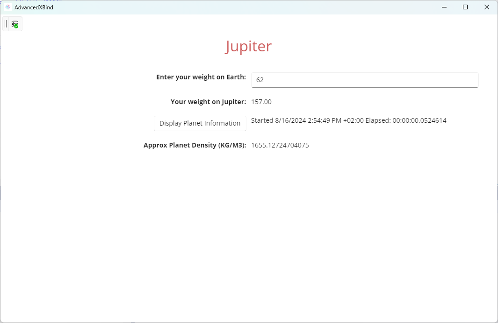

# Advanced x:Bind

The {x:Bind} markup extension (new for Windows 10) is an alternative to {Binding}. {x:Bind} runs in less time and less memory than {Binding} and supports better debugging.

This sample demonstrates the advanced use of x:Bind in the Uno Platform, showcasing how to efficiently bind data in a cross-platform application. It includes examples of binding complex data types, using x:Bind with functions, and optimizing performance through compile-time data binding. The sample also illustrates best practices for maintaining type safety, reducing boilerplate code, and enhancing UI responsiveness across different target platforms such as Windows, Android, iOS, and WebAssembly.

## What is the Uno Platform

[Uno Platform](https://platform.uno) is an open-source .NET platform for building single codebase native mobile, web, desktop, and embedded apps quickly.
For additional information about Uno Platform or if you have any feedback to share, please refer to the [README.md](../../README.md) file in this Samples repository.
