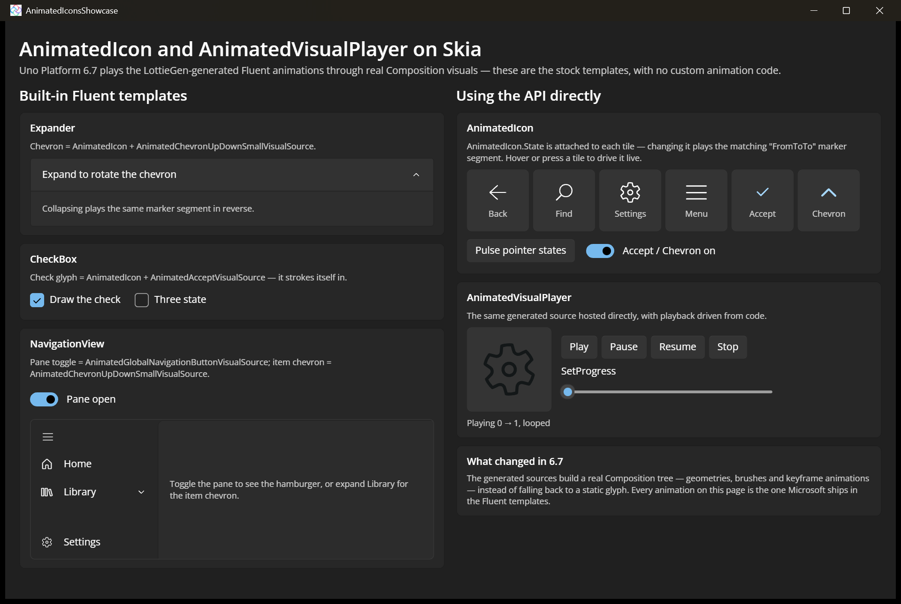

# Animated Icons Showcase

Demonstrates [AnimatedIcon](https://learn.microsoft.com/windows/windows-app-sdk/api/winrt/microsoft.ui.xaml.controls.animatedicon) and [AnimatedVisualPlayer](https://learn.microsoft.com/windows/windows-app-sdk/api/winrt/microsoft.ui.xaml.controls.animatedvisualplayer) rendering real LottieGen-generated animations through Composition visuals on Uno Platform's Skia targets. The left column shows the stock Fluent templates that use them — an `Expander` whose chevron rotates, a `CheckBox` whose check strokes itself in, and a `NavigationView` whose item chevron flips — with no custom animation code. The right column drives the same generated sources directly: `AnimatedIcon.State` transitions on hover and press, and an `AnimatedVisualPlayer` with `PlayAsync` / `Pause` / `Resume` / `Stop` / `SetProgress`.

## Codebase

* [**MainPage.xaml**](src/AnimatedIconsShowcase/MainPage.xaml): The built-in-template column (Expander, CheckBox, NavigationView) and the direct-API column — a row of `AnimatedIcon` tiles bound to the generated sources in `Microsoft.UI.Xaml.Controls.AnimatedVisuals`, plus the `AnimatedVisualPlayer` and its transport controls.
* [**MainPage.xaml.cs**](src/AnimatedIconsShowcase/MainPage.xaml.cs): Sets `AnimatedIcon.State` from pointer events and the on/off toggle, and drives the player with `PlayAsync(0, 1, looped: true)`, `Pause()`, `Resume()`, `Stop()` and `SetProgress()`.
* [**AnimatedIconsShowcase.csproj**](src/AnimatedIconsShowcase/AnimatedIconsShowcase.csproj): Uno single-project configuration targeting Desktop and WebAssembly with the Skia renderer.

## Notes

The state vocabularies differ per generated source: `Back`, `Find`, `Settings` and `GlobalNavigationButton` use `Normal` / `PointerOver` / `Pressed`, while `Accept` and `ChevronUpDownSmall` use the `…On` / `…Off` pairs. An `AnimatedIcon` plays the `{oldState}To{newState}` marker segment, so the animation is driven by state *changes*, not by the state value itself.

## What is the Uno Platform

[Uno Platform](https://platform.uno) is an open-source .NET platform for building single codebase native mobile, web, desktop, and embedded apps quickly.
For additional information about Uno Platform or if you have any feedback to share, please refer to the [README.md](../../README.md) file in this Samples repository.
