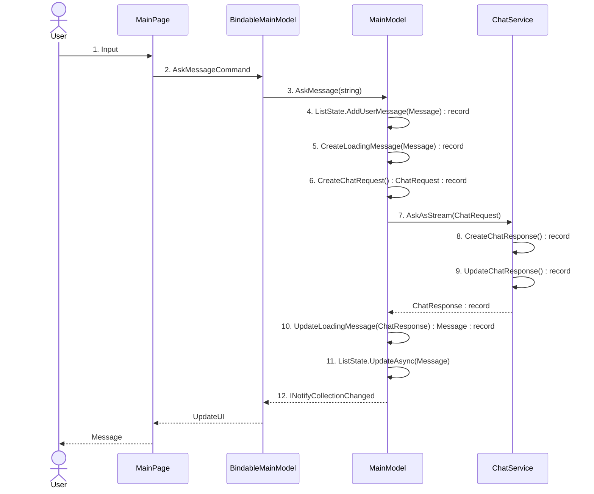

# ChatGPT - MVUX

## Guidance to use Records with MVUX

### What is a Record

A record behaves like a class, offering the feature of **immutability**, where the values assigned to it remain unchanged once set. It's possible to create records using the `record` modifier, for example:

```csharp
public record MyRecord()
```

Records **can** be, but are not necessarily, immutable.

### Why Immutability in MVUX

Immutability is crucial in MVUX for two main reasons:

**Predictable State Changes**

Immutability ensures that once we set a state, it can't be changed. This predictability makes it easier to understand how our application behaves over time. In MVUX, we use immutable data structures to represent the application state.

**Concurrency and Threading**

Immutability makes our application more robust in handling concurrency and threading challenges. Immutable data structures are naturally thread-safe, reducing the risk of bugs related to multiple things happening simultaneously in our app.

### How to create immutable records

You can create immutable records in two ways. First, declare your record with a primary constructor and parameters; this will create an immutable record with the specified parameters as its properties:

```csharp
public partial record ChatResponse(string Message, bool IsError);
```

Another way is by creating properties using the `init` keyword instead of `set` to enforce immutability. Here's a brief example:

```csharp
public partial record ChatResponse
{
    public string Message { get; init; }
    public bool IsError { get; init; }
}
```

When you create a record, if you let the properties change with the `set` keyword, the record won't be immutable. This means you won't be able to lock in or keep the values from changing once you've set them.

### How to use records with MVUX

Records can be instantiated from the presentation layer as a parameter for a request or in the business layer, where data is usually retrieved/processed. For example, in our `ChatService`, we would have the following method being called from the Model. A `ChatEntry` list is received as a parameter from the Model, where `ChatEntry` is also a record, and we create an instance of `ChatResponse`, returning it to the Model:

```csharp
public async ValueTask<ChatResponse> AskAsync(IImmutableList<ChatEntry> history)
{
    var request = CreateRequest(history);

    var result = await _client.CreateCompletion(request);

    if (result.Successful)
    {
        var response = result.Choices.Select(choice => choice.Message.Content);

        return new ChatResponse(string.Join("", responseContent));
    }
    else
    {
        return new ChatResponse(result.Error?.Message, IsError: true);
    }
}
```

### Updating records

As we are dealing with immutable records, it's not possible to update them or their properties. To achieve that, we need to create a new instance based on the previous record. This ensures we are not modifying data from the UI in the wrong thread. See the example:

Given the `Message` record:

```csharp
public partial record Message(string Content, Status status, Source source);
```

In our Model:

```csharp
...

message = message with
{
    Content = response.Message,
    Status = response.IsError ? Status.Error : Status.Value
};

//Then you can update your message list displayed in the UI, thread-safe
await Messages.UpdateAsync(message);
...

```

## Architecture Diagram

See below a Sequence Diagram showing how data is processed:



Steps description:

1. The user types a message in the TextBox.
2. The `AskMessageCommand` is invoked in the auto-generated `BindableMainModel`.
3. The `BindableMainModel` calls the `AskMessage(string)` method in the MainModel.
4. A new `Message` record is created with the user's prompt and then added to the `ListState` (ImmutableList).
5. A new loading `Message` record is created and added to the `ListState`.
6. A `ChatRequest` record is created with the user's message.
7. The MainModel calls the `AskAsStream()` method with the `ChatRequest`.
8. An empty `ChatResponse` record is created.
9. As the AI returns a response, the `ChatResponse` record is updated until the AI finishes.
10. The loading `Message` record (created in step 5) is updated with the AI response.
11. `ListState.UpdateAsync` finds the message with the same `Id` and updates the instance, ensuring thread safety throughout the process.
12. `INotifyCollectionChanged` is raised to update the UI with the new message.