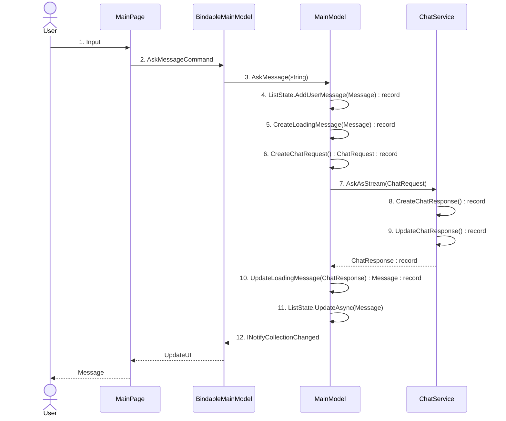

# ChatGPT

This is a ChatGPT Sample app using the OpenAI SDK. The app was built using C# Markup for the UI and MVUX for state management, encouraging the flow of immutable data. Records are used to manage state and ensure immutability.

## Getting Started

1. **OpenAI API Key**: Obtain your OpenAI API key by visiting [https://platform.openai.com/api-keys](https://platform.openai.com/api-keys).

2. **Update Configuration**: After obtaining your API key, update the `appsettings.json` configuration file in the project with your OpenAI API key. Locate the `ApiKey` field and replace the placeholder with your actual API key.

```json
{
  "AppConfig": {
    "Environment": "Production",
    "ApiKey": "YOUR_API_KEY_HERE"
  }
}
```

## Codebase

 * [**MainPage.cs**](ChatGPT/ChatGPT/Presentation/MainPage.cs): Defines the main user interface using C# Markup.
 * [**MainModel.cs**](ChatGPT/ChatGPT/Presentation/MainModel.cs): Handle user input and methods to interact with the AI.
 * [**ChatService.cs**](ChatGPT/ChatGPT/Services/ChatService.cs): Manages communication with the OpenAI API using the OpenAI SDK. This file contains the code responsible for making requests to the OpenAI API and handling the responses.
 * [**Message.cs**](ChatGPT/ChatGPT/Presentation/Message.cs): Record that represents a message sent by user or the AI.
 * [**ChatRequest.cs**](ChatGPT/ChatGPT/Business/ChatRequest.cs): Record representing a request sent to the ChatGPT model.
 * [**ChatResponse.cs**](ChatGPT/ChatGPT/Business/ChatResponse.cs): Record representing a response received from the ChatGPT model.

## Architecture Diagram

See below a Sequence Diagram showing how data is processed:



Steps description:

1. The user types a message in the TextBox.
2. The `AskMessageCommand` is invoked in the auto-generated `BindableMainModel`.
3. The `BindableMainModel` calls the `AskMessage(string)` method in the MainModel.
4. A new `Message` record is created with the user's prompt and then added to the `ListState` (ImmutableList).
5. A new loading `Message` record is created and added to the `ListState`.
6. A `ChatRequest` record is created with the user's message.
7. The MainModel calls the `AskAsStream()` method with the `ChatRequest`.
8. An empty `ChatResponse` record is created.
9. As the AI returns a response, the `ChatResponse` record is updated until the AI finishes.
10. The loading `Message` record (created in step 5) is updated with the AI response.
11. `ListState.UpdateAsync` finds the message with the same `Id` and updates the instance, ensuring thread safety throughout the process.
12. `INotifyCollectionChanged` is raised to update the UI with the new message.

## Learn More
- [C# Markup](https://aka.platform.uno/csharp-markup) 
- [MVUX](https://aka.platform.uno/mvux)
- [Using Immutable Records with MVUX](RecordsGuidance.md)