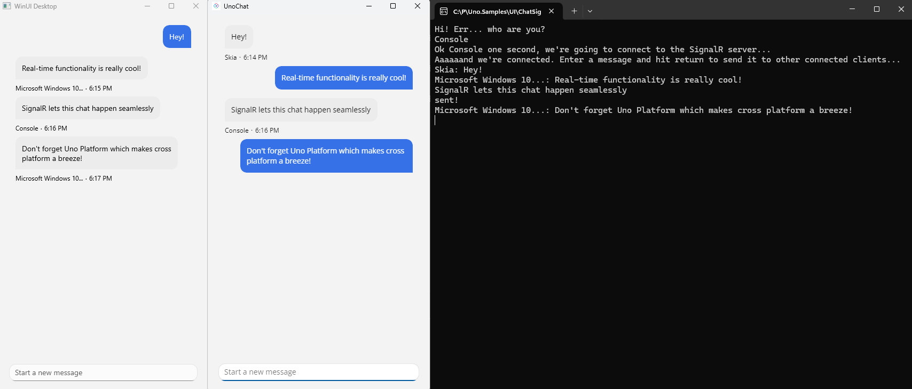

# Chat SignalR App

Implements [SignalR library](https://learn.microsoft.com/en-us/aspnet/core/signalr/introduction?view=aspnetcore-3.1) for asynchronous notifications in an Uno Platform application.

To try out the sample, first launch an instance of the UnoChat.Service project which hosts the server that the chat clients will connect to. Next, simply launch any number of UnoChat projects which will serve as the chat clients. If you want to add chat clients that are hosted by system consoles, you can launch any number of them as well using the UnoChat.Client.Console project.

## Codebase

* [**UnoChat.Service**](src/UnoChat.Service/Program.cs): Configurable server
* [**UnoChat Client**](src/UnoChat/Presentation/ViewModel.cs): Cross-platform client
* [**UnoChat.Client.Console**](src/UnoChat.Client.Console/Program.cs): System console client

## What is the Uno Platform

[Uno Platform](https://platform.uno) is an open-source .NET platform for building single codebase native mobile, web, desktop, and embedded apps quickly.
For additional information about Uno Platform or if you have any feedback to share, please refer to the [README.md](../../README.md) file in this Samples repository.