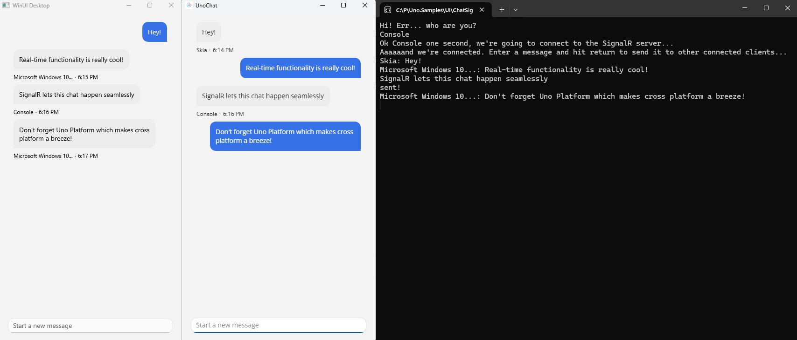

# Chat SignalR App

Implements [ASP.NET Core SignalR](https://learn.microsoft.com/en-us/aspnet/core/signalr/introduction) for real-time notifications in an Uno Platform application.

To try out the sample:

1. Launch `UnoChat.Service` first (the SignalR server).
2. Launch one or more `UnoChat` clients (Uno Platform app).
3. Optionally launch one or more `UnoChat.Client.Console` clients.

All clients connect to `https://localhost:7167/chatHub` by default.

> [!NOTE]
> An Azure account is not required for this sample. It runs locally.

## Quick start

From `src/`:

```bash
# Run the SignalR server
dotnet run --project UnoChat.Service

# Run the console client (optional)
dotnet run --project UnoChat.Client.Console
```

Run the Uno app from your IDE using one of the platform launch profiles in `UnoChat`.



## Codebase

* [**UnoChat.Service**](src/UnoChat.Service/Program.cs): Configurable server
* [**UnoChat Client**](src/UnoChat/Presentation/ViewModel.cs): Cross-platform client
* [**UnoChat.Client.Console**](src/UnoChat.Client.Console/Program.cs): System console client

## What is the Uno Platform

[Uno Platform](https://platform.uno) is an open-source .NET platform for building single codebase native mobile, web, desktop, and embedded apps quickly.
For additional information about Uno Platform or if you have any feedback to share, please refer to the [README.md](../../README.md) file in this Samples repository.