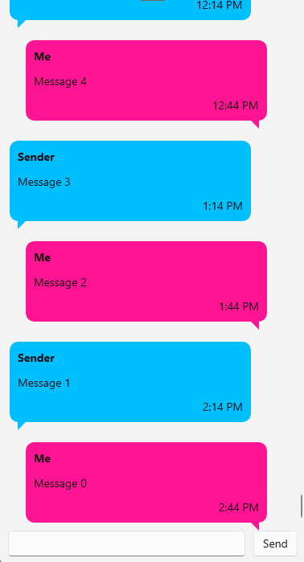

# Chat UI App

UI template for a chat app ready to be hooked up to a service with real data. This cross-platform chat app uses [MVUX](xref:Uno.Extensions.Mvux.Overview) to handle incoming data.

## Codebase

* [**MessageService.cs**](src/ChatUI/Services/MessageService.cs): Messaging service ready to be hooked up to your custom service that can fetch real messages.
* [**MainPage.xaml**](src/ChatUI/MainPage.xaml): All message templates and chat UI using MVUX

## What is the Uno Platform

[Uno Platform](https://platform.uno) is an open-source .NET platform for building single codebase native mobile, web, desktop, and embedded apps quickly.
For additional information about Uno Platform or if you have any feedback to share, please refer to the [README.md](../../README.md) file in this Samples repository.