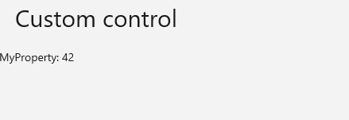

# Control Library App

A small sample that showcases a custom control library and its reference in a cross-platform app.

## Codebase

* [**MyTemplatedControl.cs**](src/XamlControlLibrary/MyTemplatedControl.cs): Templated control ready to be referenced and used throughout the app
* [**MainPage.xaml**](src/XamlControlLibrary/MainPage.xaml): References the custom control

## What is the Uno Platform

[Uno Platform](https://platform.uno) is an open-source .NET platform for building single codebase native mobile, web, desktop, and embedded apps quickly.
For additional information about Uno Platform or if you have any feedback to share, please refer to the [README.md](../../README.md) file in this Samples repository.