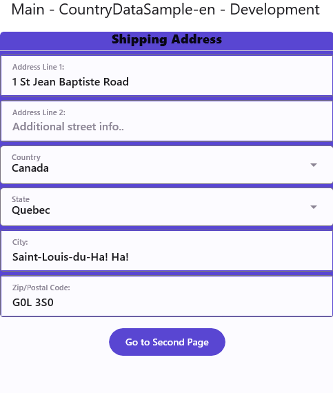
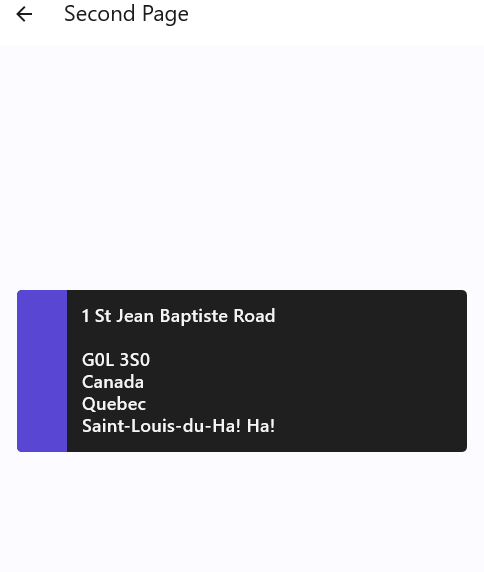

# CountryDataSample

Enter and display address information using real countries and states from the [CountryData.Standard nuget package](https://www.nuget.org/packages/CountryData.Standard).

## Codebase

* [**CountryConstants.cs**](src/CountryDataSample/Business/CountryConstants.cs): Helper class that gets and preps the country information from CountryData.Standard.
* [**MainPage.xaml**](src/CountryDataSample/Presentation/MainPage.xaml): Page with inputs bound to all the country data.

## What is the Uno Platform

[Uno Platform](https://platform.uno) is an open-source .NET platform for building single codebase native mobile, web, desktop, and embedded apps quickly.
For additional information about Uno Platform or if you have any feedback to share, please refer to the [README.md](../../README.md) file in this Samples repository.
