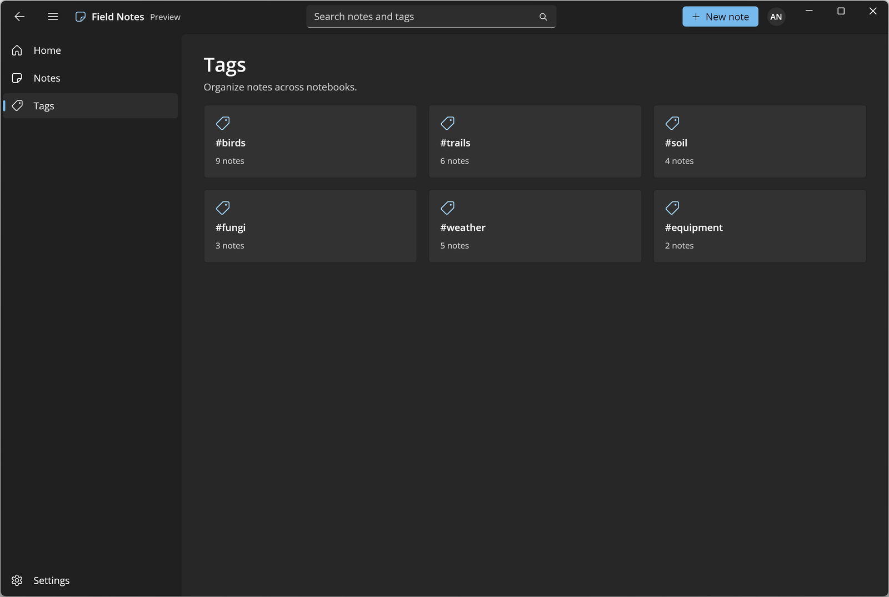

# Custom Title Bar

This sample shows a custom title bar on Uno Platform. The window extends its content into the title bar ([`Window.ExtendsContentIntoTitleBar`](https://learn.microsoft.com/windows/windows-app-sdk/api/winrt/microsoft.ui.xaml.window.extendscontentintotitlebar)) and registers a XAML element with [`Window.SetTitleBar`](https://learn.microsoft.com/windows/windows-app-sdk/api/winrt/microsoft.ui.xaml.window.settitlebar). The title bar hosts an icon, title, a back button bound to `Frame.CanGoBack`, a pane toggle that drives a `NavigationView`, a search `AutoSuggestBox`, and a button and `PersonPicture` on the right. Interactive elements are excluded from the drag region with `InputNonClientPointerSource`. See the [title bar documentation](https://platform.uno/docs/articles/features/title-bar.html) for details.

## Codebase

- `src/CustomTitleBar/App.xaml.cs` - creates the window and enables `ExtendsContentIntoTitleBar`
- `src/CustomTitleBar/MainPage.xaml` - the title bar `Grid` and the `NavigationView` with its `Frame`
- `src/CustomTitleBar/MainPage.xaml.cs` - `SetTitleBar`, passthrough regions, back and pane toggle handling and navigation sync
- `src/CustomTitleBar/Views/` - Home, Notes, Tags and Settings pages

## What is the Uno Platform

[Uno Platform](https://platform.uno) is an open-source platform for building single codebase native mobile, web, desktop and embedded apps quickly.
