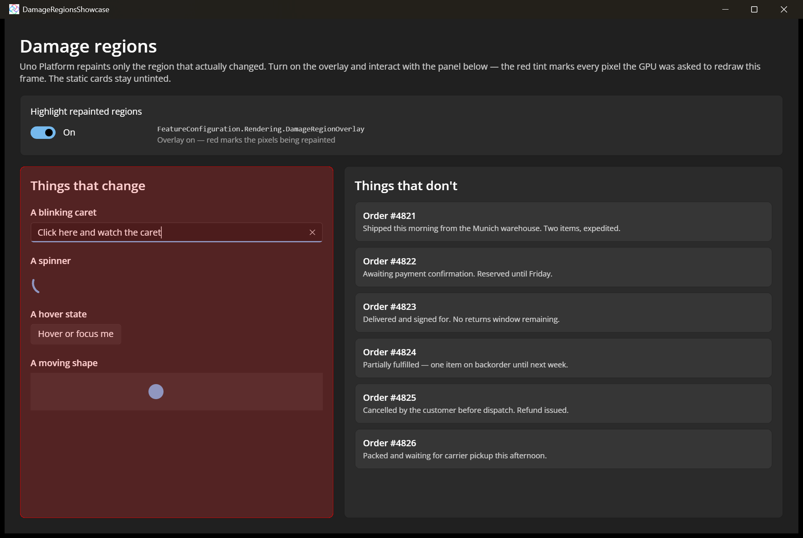

# Damage Regions Showcase

Demonstrates the partial-repaint (damage region) rendering that Uno Platform applies on every Skia target. Instead of redrawing the whole window each frame, only the region that actually changed is re-rasterized. The sample puts everything that animates on the left and everything static on the right, then lets you switch on `FeatureConfiguration.Rendering.DamageRegionOverlay` to tint the repainted pixels red — the boundary falls exactly between the two columns.

Damage regions are on by default and need no app changes; the overlay is a diagnostic aid for tuning your own UI.

## Codebase

* [**MainPage.xaml**](src/DamageRegionsShowcase/MainPage.xaml): The two-column layout — a "Things that change" card holding a `TextBox` with a blinking caret, a `ProgressRing`, a hoverable `Button` and an animated `Ellipse`, next to a "Things that don't" card of static content — plus the `ToggleSwitch` that drives the overlay.
* [**MainPage.xaml.cs**](src/DamageRegionsShowcase/MainPage.xaml.cs): Sets `Uno.UI.FeatureConfiguration.Rendering.DamageRegionOverlay` from the toggle, and runs the ellipse slide with a `DoubleAnimationUsingKeyFrames` storyboard.
* [**DamageRegionsShowcase.csproj**](src/DamageRegionsShowcase/DamageRegionsShowcase.csproj): Uno single-project configuration targeting Desktop and WebAssembly with the Skia renderer.

## What is the Uno Platform

[Uno Platform](https://platform.uno) is an open-source .NET platform for building single codebase native mobile, web, desktop, and embedded apps quickly.
For additional information about Uno Platform or if you have any feedback to share, please refer to the [README.md](../../README.md) file in this Samples repository.
