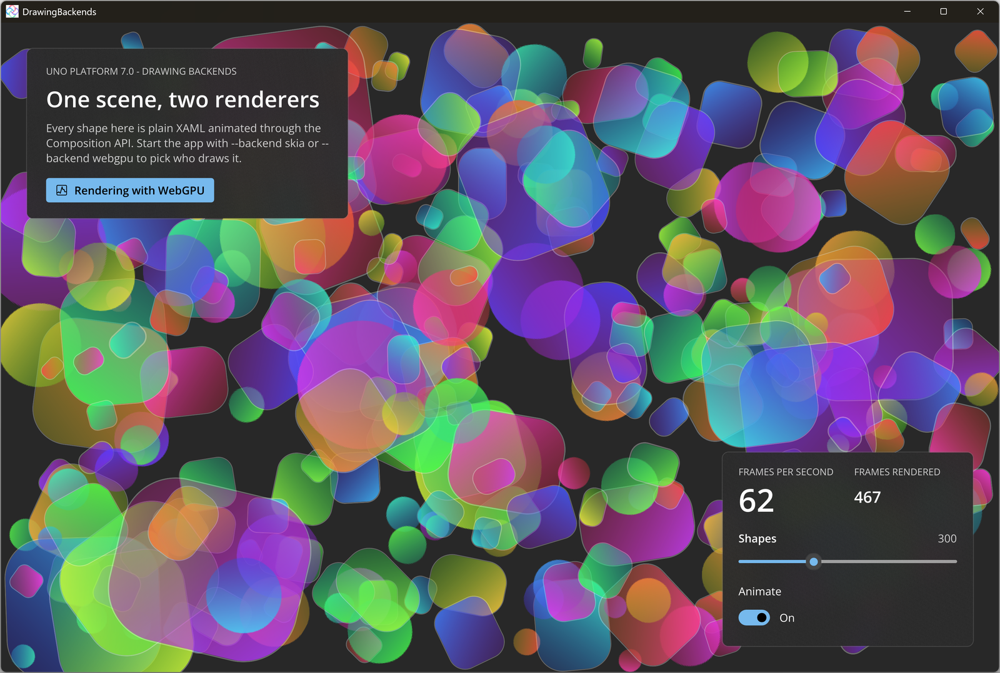

# Drawing Backends

Uno Platform 7.0 draws the UI through a pluggable [drawing backend](https://platform.uno/docs/articles/features/using-skia-desktop.html). This sample renders the same animated scene (hundreds of gradient-filled shapes spun and pulsed with the [Composition API](https://learn.microsoft.com/windows/windows-app-sdk/api/winrt/microsoft.ui.composition.compositor)) with the default Skia backend or the opt-in WebGPU backend. Pick one at startup with `--backend skia` or `--backend webgpu`; a badge shows the active backend and a live counter built on [CompositionTarget.Rendering](https://learn.microsoft.com/windows/windows-app-sdk/api/winrt/microsoft.ui.xaml.media.compositiontarget.rendering) reports frames per second.

## Codebase

- `src/DrawingBackends/DrawingBackends.csproj` - names the `Skia` and `WebGpu` features
- `src/DrawingBackends/Platforms/Desktop/Program.cs` - parses `--backend` and registers it with `GraphicsBackend(...)`
- `src/DrawingBackends/BackendInfo.cs` - the chosen backend, shown in the UI
- `src/DrawingBackends/MainPage.xaml` and `MainPage.xaml.cs` - the scene, the FPS counter and the controls
- `src/Directory.Build.targets` - works around a private-SDK task loading failure (see the comment in the file)

## What is the Uno Platform

[Uno Platform](https://platform.uno) is an open-source platform for building single codebase native mobile, web, desktop and embedded apps quickly.
