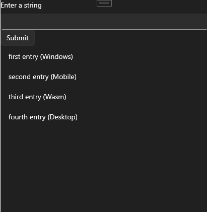

# EntityFrameworkCore SQLite Sample

Uses [EntityFrameworkCore](https://learn.microsoft.com/en-us/ef/core/) along with [SQLite](https://www.sqlite.org/) to implement a local database with an input to add new items in a cross-platform application. Multiple clients can be connected and update the database simultaneously.

## Codebase

* [**BloggingContext.cs**](src/EFCoreSQLiteSample/BloggingContext.cs): Connects the client to the local [SQLite](https://www.sqlite.org/) instance and implements [EntityFrameworkCore DbSets](https://learn.microsoft.com/en-us/dotnet/api/microsoft.entityframeworkcore.dbset-1?view=efcore-8.0)

## What is the Uno Platform

[Uno Platform](https://platform.uno) is an open-source .NET platform for building single codebase native mobile, web, desktop, and embedded apps quickly.
For additional information about Uno Platform or if you have any feedback to share, please refer to the [README.md](../../README.md) file in this Samples repository.