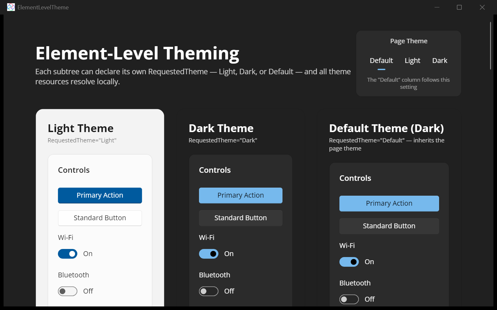

# Element-Level Theming

Demonstrates **element-level theming** in [Uno Platform](https://platform.uno): any `FrameworkElement` can declare its own `RequestedTheme` (Light, Dark, or Default), and all theme resources resolve **locally** within that subtree — independent of the app-wide theme. This first-class per-element theming landed on the Skia targets in **Uno Platform 6.6** ([PR #22803](https://github.com/unoplatform/uno/pull/22803)).

The same control tree is rendered three ways side by side — a `RequestedTheme="Light"` island, a `RequestedTheme="Dark"` island, and a `RequestedTheme="Default"` island that inherits the page theme — plus a page-level theme switcher and a nested "matryoshka" showcase of alternating themes.

## Features shown

- Setting `FrameworkElement.RequestedTheme` on any element (`Border`, `StackPanel`, …).
- Local theme-resource resolution: `{ThemeResource}` brushes pick up the nearest requested theme.
- Live switching of a subtree's theme at runtime, and nested theme islands.

## Codebase

- **[MainPage.xaml](src/ElementLevelTheme/MainPage.xaml)**: Three-column layout (Light, Dark, Default) with nested theme islands and a matryoshka nesting showcase of up to 5 levels of alternating themes.
- **[MainPage.xaml.cs](src/ElementLevelTheme/MainPage.xaml.cs)**: Page-level theme toggling and dynamic runtime theme switching.

## What is the Uno Platform

[Uno Platform](https://platform.uno) is an open-source .NET platform for building single-codebase native mobile, web, desktop, and embedded apps quickly.
For additional information about Uno Platform or if you have any feedback to share, please refer to the [README.md](../../README.md) file in this Samples repository.
