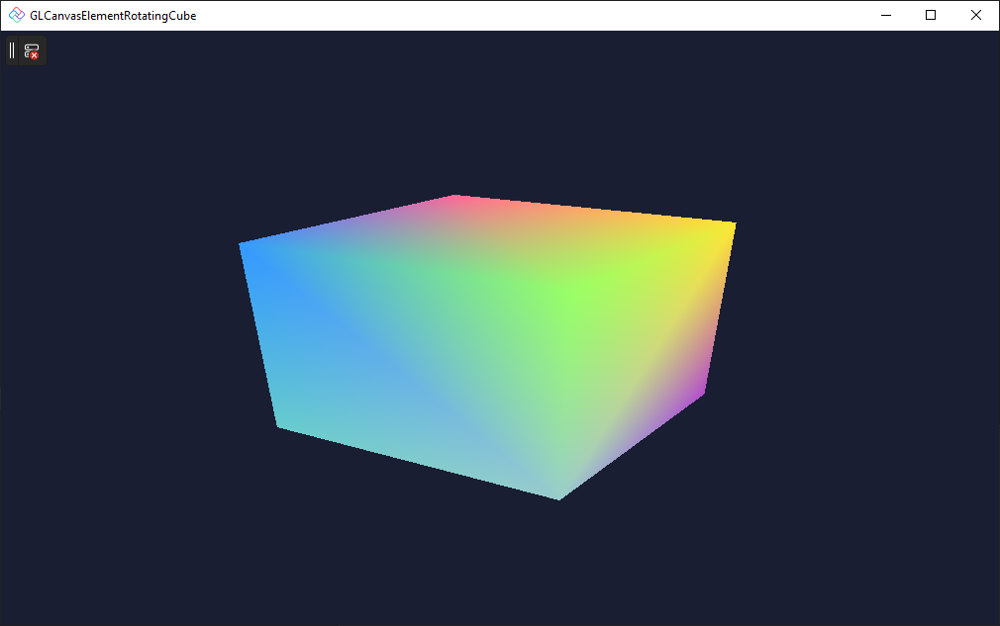

* GLCanvasElementSimpleTriangle

This sample draws a rotating 3D cube with interpolated colors using GLCanvasElement. It showcases various fundamental elements of drawing using OpenGL and GLCanvasElement, such as managing the lifetime of GL objects and calculating the perspective matrix.