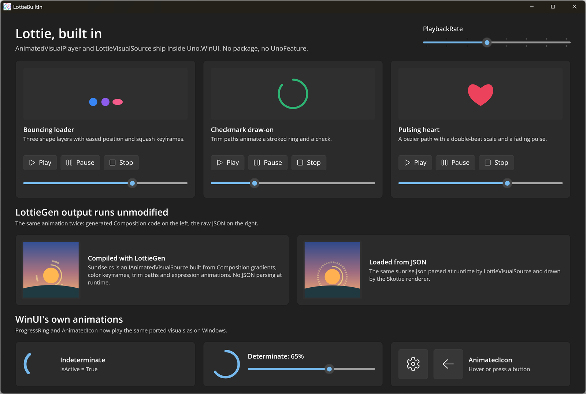

# Lottie Built In

Shows that Lottie is built into Uno Platform 7.0: `AnimatedVisualPlayer`, `LottieVisualSource` and the Skottie renderer ship inside `Uno.WinUI`, so there is no `Uno.WinUI.Lottie` package and no `Lottie` UnoFeature. Three hand-authored Lottie JSON files play in [AnimatedVisualPlayer](https://learn.microsoft.com/windows/windows-app-sdk/api/winrt/microsoft.ui.xaml.controls.animatedvisualplayer) with Play, Pause, Stop, a progress scrubber (`SetProgress`) and a shared `PlaybackRate` slider. The second row shows WinUI's own ported animations: an indeterminate and a determinate [ProgressRing](https://learn.microsoft.com/windows/windows-app-sdk/api/winrt/microsoft.ui.xaml.controls.progressring) and [AnimatedIcon](https://learn.microsoft.com/windows/windows-app-sdk/api/winrt/microsoft.ui.xaml.controls.animatedicon) buttons that react to hover. A fourth section plays the same sunrise animation twice: once as C# generated by [LottieGen](https://learn.microsoft.com/windows/communitytoolkit/animations/lottie-scenarios/getting_started_codegen) (an `IAnimatedVisualSource` made of plain Composition code, unmodified) and once loaded from its JSON at runtime. See the [Lottie documentation](https://platform.uno/docs/articles/features/Lottie.html) for details.

## Codebase

- `src/LottieBuiltIn/MainPage.xaml` - page layout, ProgressRings and AnimatedIcons
- `src/LottieBuiltIn/LottieCard.xaml` and `.xaml.cs` - reusable card with an `AnimatedVisualPlayer` and playback controls
- `src/LottieBuiltIn/Assets/Lottie/*.json` - the hand-authored Lottie animations
- `src/LottieBuiltIn/AnimatedVisuals/Sunrise.cs` - LottieGen output for `sunrise.json` (`lottiegen -InputFile Assets/Lottie/sunrise.json -Language cs -Namespace LottieBuiltIn.AnimatedVisuals -WinUIVersion 3.0`), unmodified
- `src/LottieBuiltIn/App.xaml` - shared card style

## What is the Uno Platform

[Uno Platform](https://platform.uno) is an open-source platform for building single codebase native mobile, web, desktop and embedded apps quickly.
