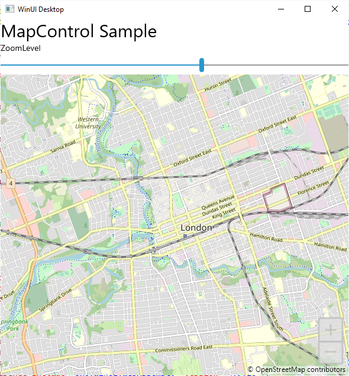
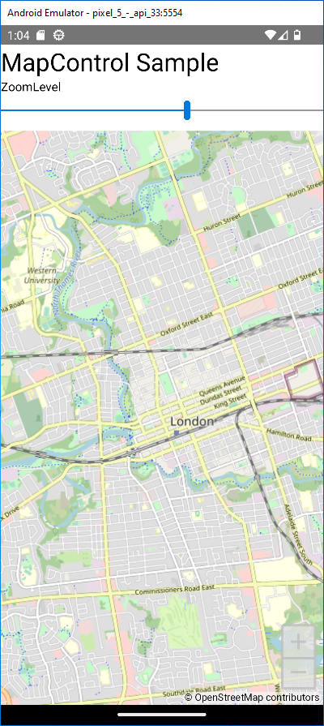
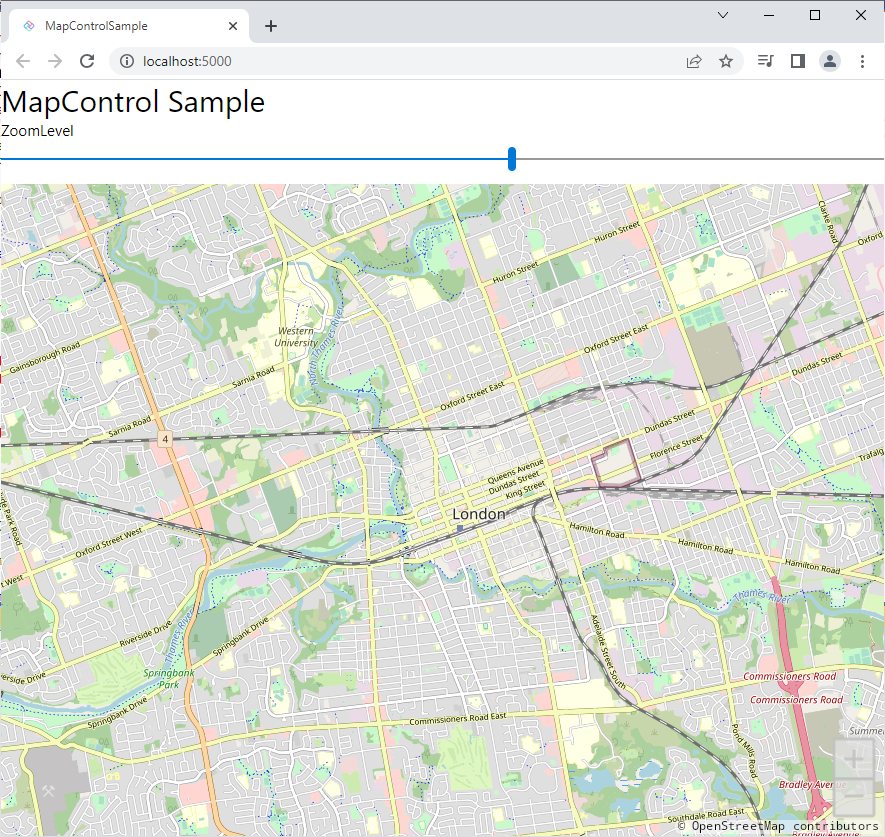

# Uno Platform MapControl sample

This is a small standalone sample illustrating how to use [MapControl](https://docs.microsoft.com/en-us/uwp/api/Windows.UI.Xaml.Controls.Maps.MapControl) in an Uno Platform app.

You can find [detailed instructions on configuring map support in your app](https://platform.uno/docs/articles/controls/map-control-support.html) in the Uno Platform documentation.

