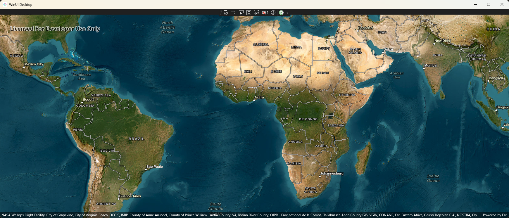
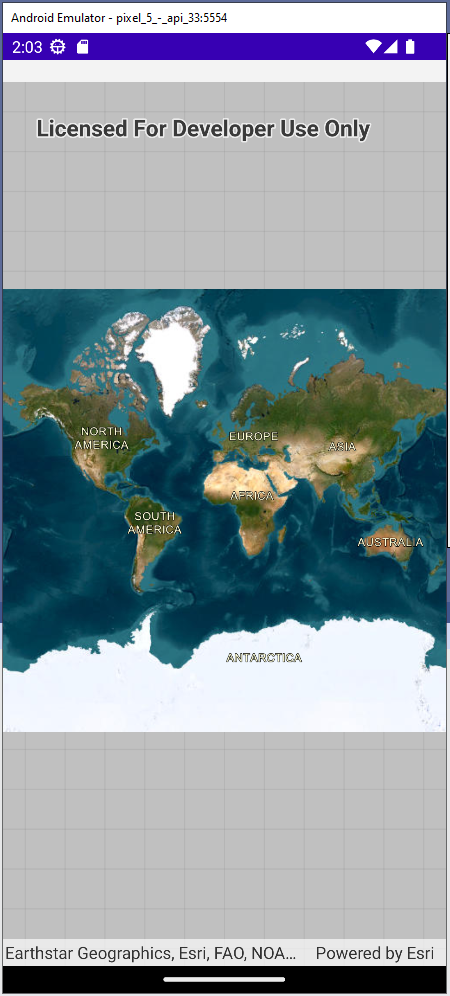

# .NET MAUI Embedding Sample App - ArcGIS Maps SDK for .NET

This sample app embeds the [ArcGIS Maps SDK for .NET](https://developers.arcgis.com/net/) in an Uno Platform application.

For more information on how to use the controls from EsriMaps in an Uno Platform application via .NET MAUI Embedding, please visit [our documentation here](https://aka.platform.uno/maui-embedding-sample-app-arcgis).

> [!NOTE]
> In order to use the MapView control, you first need to create an account via the [ArcGIS Developers portal](https://developers.arcgis.com/sign-up/), and depending on the use of location services, you may also need an API key. This walkthrough does not require a license or an API key to run.

## List of controls used in this sample
- MapView

## Sample App - Examples

### Windows

 

### Android

 

## Sample App - Issues
If you encounter any issues with this sample, please open an issue [here](https://github.com/unoplatform/uno/issues).