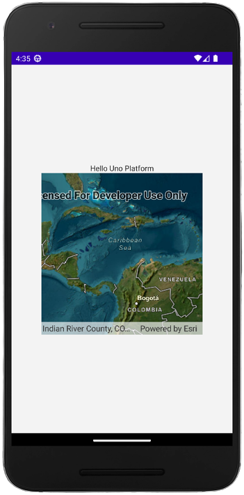
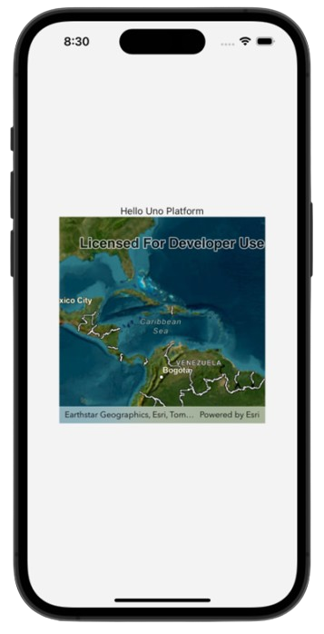
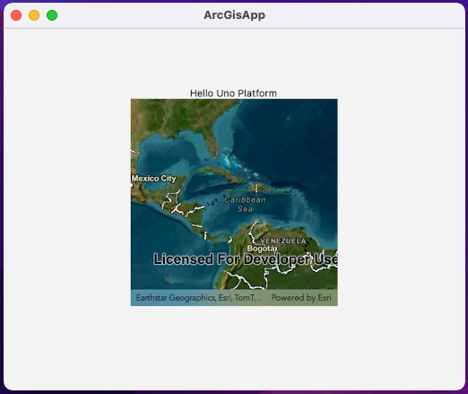

# .NET MAUI Embedding Sample App - ArcGIS Maps SDK for .NET

This sample app embeds the [ArcGIS Maps SDK for .NET](https://developers.arcgis.com/net/) in an Uno Platform application.

For more information on how to use the controls from EsriMaps in an Uno Platform application via .NET MAUI Embedding, please visit [our documentation here](https://aka.platform.uno/maui-embedding-sample-app-arcgis).

> [!NOTE]
> In order to use the MapView control, you first need to create an account via the [ArcGIS Developers portal](https://developers.arcgis.com/sign-up/), and depending on the use of location services, you may also need an API key. This walkthrough does not require a license or an API key to run.

## List of controls used in this sample

- MapView

## Sample App - Examples

- **Android:**

    

- **iOS:**

    

- **Mac Catalyst:**

    

- **Windows:**

    

## Sample App - Issues

If you encounter any issues with this sample, please open an issue [here](https://github.com/unoplatform/uno/issues).

## What is the Uno Platform

[Uno Platform](https://platform.uno) is an open-source .NET platform for building single codebase native mobile, web, desktop, and embedded apps quickly.
For additional information about Uno Platform or if you have any feedback to share, please refer to the [README.md](../../../README.md) file in this Samples repository.
