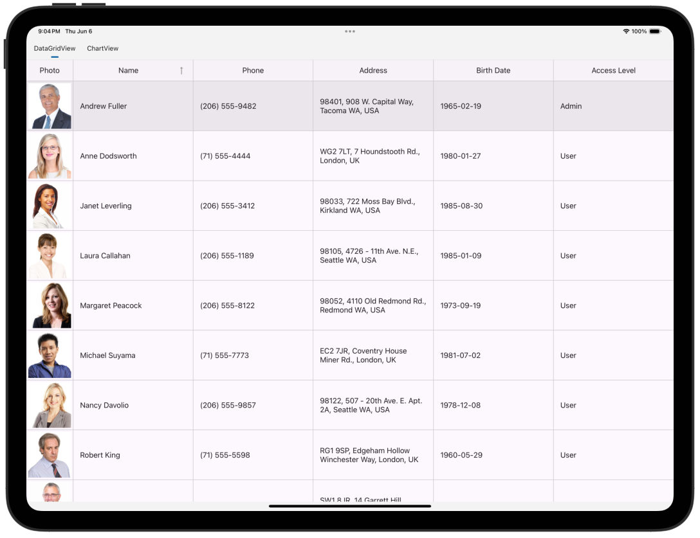
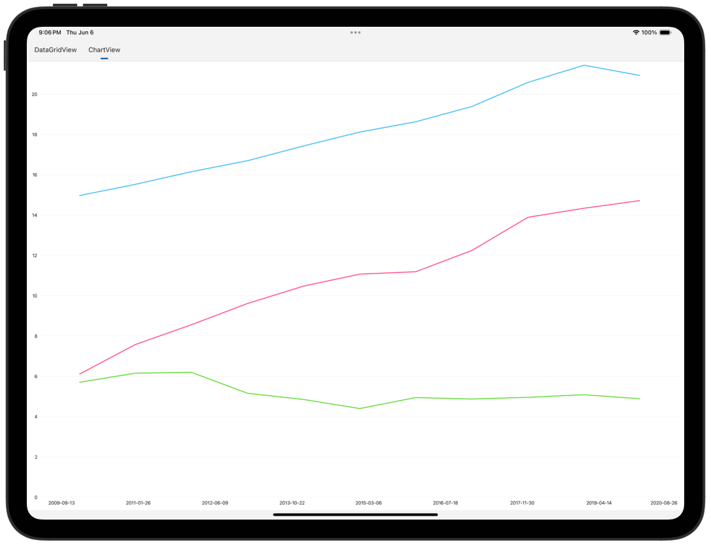
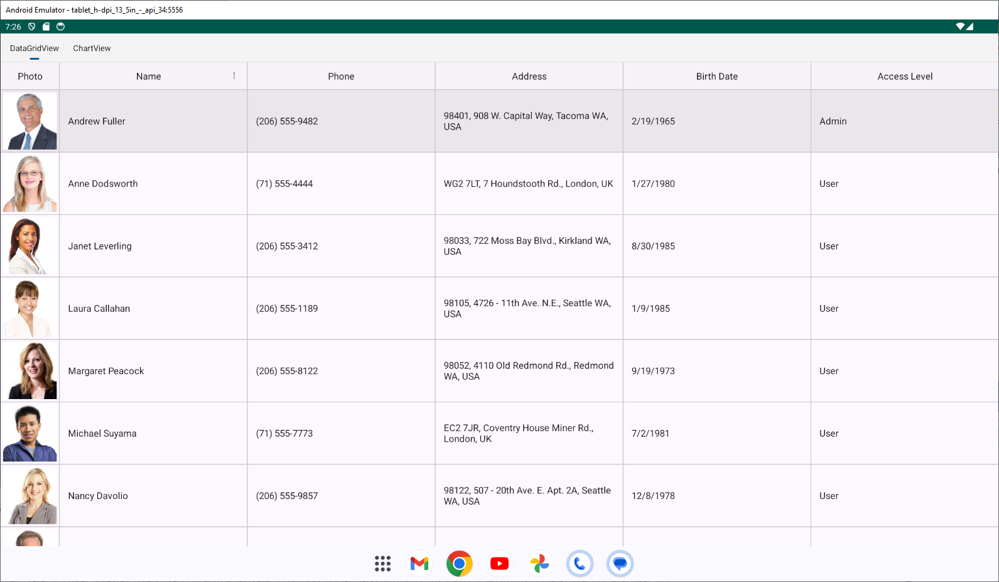
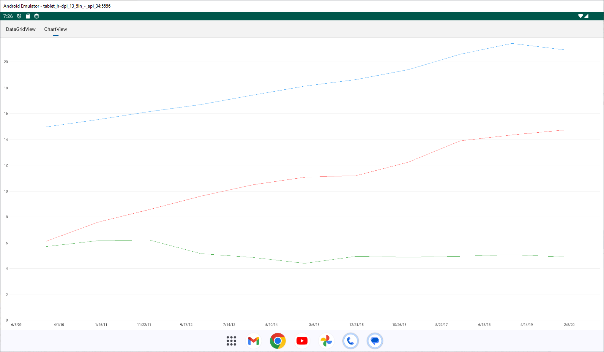

# .NET MAUI Embedding Sample App - DevExpress .NET MAUI Controls

This sample app embeds the [DevExpress .NET MAUI Controls](https://www.devexpress.com/maui/) in an Uno Platform application.

For more information on how to use the controls from DevExpress in an Uno Platform application via .NET MAUI Embedding, please visit [our documentation here](https://aka.platform.uno/maui-embedding-sample-app-devexpress).


> [!IMPORTANT]
> The DevExpress .NET MAUI Controls are currently available [free of charge](https://www.devexpress.com/maui/). However, in order to access the NuGet packages you do need to create an account at [DevExpress website](https://www.devexpress.com/MyAccount/Register/?returnUrl=https%3a%2f%2fnuget.devexpress.com%2f%23feed-url).
>
> Once you have an account with DevExpress, you need to visit the [Your DevExpress NuGet Feed URL](https://nuget.devexpress.com/#feed-url) page to retrieve a NuGet feed that's associated with your account. You can either add this as a NuGet feed in Visual Studio or use a nuget.config file.
>
> ```xml
> <?xml version="1.0" encoding="utf-8"?>
> <configuration>
>   <packageSources>
>    <add key="DevExpress Private Feed" value="[your NuGet feed goes here]" />
>   </packageSources>
> </configuration>
> ```
>
> To summarize in order to test this sample app:
>
> 1. Create a DevExpress account and obtain the necessary licenses for the DevExpress packages.
> 2. Add your [DevExpress NuGet Feed URL](https://nuget.devexpress.com/#feed-url) to the project.
> 3. Look for comments marked with "IMPORTANT: TODO: Uncomment to test the DevExpressApp" and uncomment the corresponding code blocks.

## List of controls used in this sample

- DataGridView
- ChartView

## Sample App - Examples

- **iOS:**
  - **DataGridView**
    
  - **ChartView**
    

- **Android:**
  - **DataGridView**
    
  - **ChartView**
    

## Sample App - Issues

If you encounter any issues with this sample, please open an issue [here](https://github.com/unoplatform/uno/issues).

## What is the Uno Platform

[Uno Platform](https://platform.uno) is an open-source .NET platform for building single codebase native mobile, web, desktop, and embedded apps quickly.
For additional information about Uno Platform or if you have any feedback to share, please refer to the [README.md](../../../README.md) file in this Samples repository.
