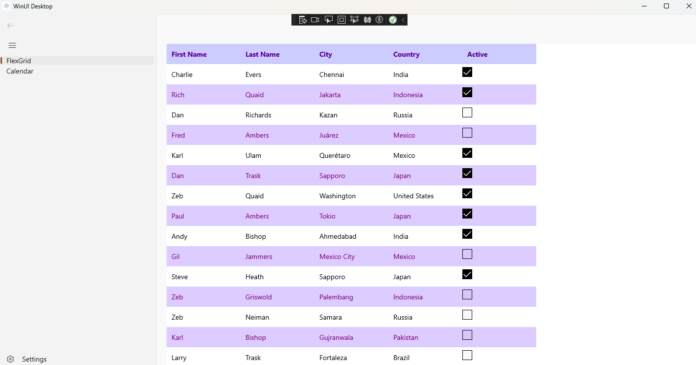
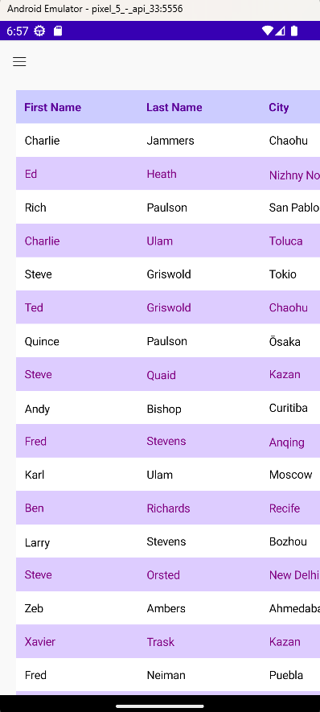

# .NET MAUI Embedding Sample App - GrapeCity ComponentOne .NET MAUI Controls 

This sample app embeds the [GrapeCity ComponentOne .NET MAUI Controls](https://www.grapecity.com/componentone/docs/maui/online-maui/overview.html) in an Uno Platform application.

For more information on how to use the controls from GrapeCity in an Uno Platform application via .NET MAUI Embedding, please visit [our documentation here](https://aka.platform.uno/maui-embedding-sample-app-grapecity).

> [!NOTE]
> In order to use the ComponentOne controls, you first need to install the ComponentOne ControlPanel following [these instructions](https://www.grapecity.com/componentone/docs/maui/online-maui/get-started.html).

## List of controls used in this sample
- FlexGrid
- Calendar

## Sample App - Examples

### Windows

 

### Android

 

## Sample App - Issues
If you encounter any issues with this sample, please open an issue [here](https://github.com/unoplatform/uno/issues).