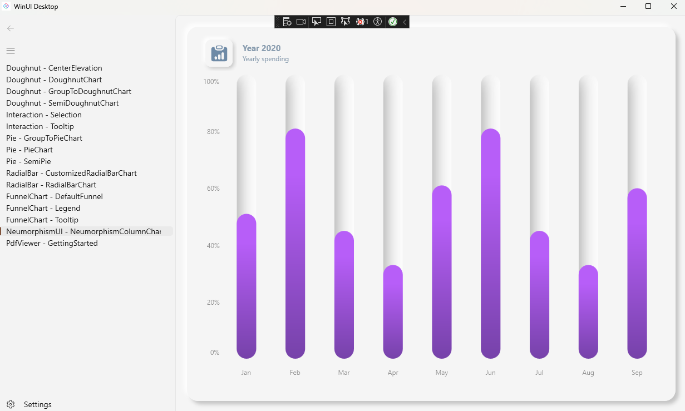
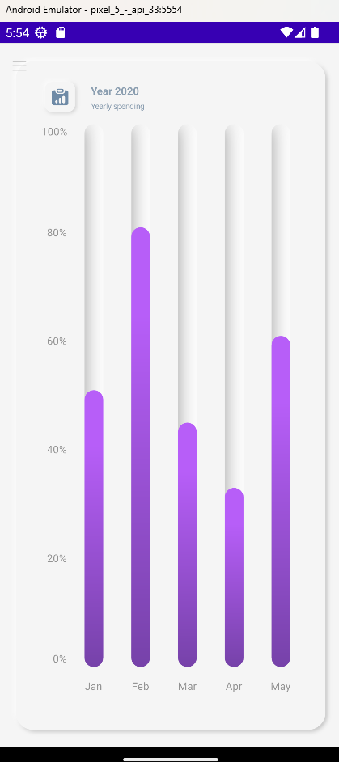

# .NET MAUI Embedding Sample App - Syncfusion .NET MAUI Controls

This sample app embeds the [Syncfusion .NET MAUI Controls](https://www.syncfusion.com/maui-controls) in an Uno Platform application.

For more information on how to use the controls from Syncfusion in an Uno Platform application via .NET MAUI Embedding, please visit [our documentation here](https://aka.platform.uno/maui-embedding-sample-app-syncfusion).

> [!NOTE]
> In order to use the Syncfusion controls, you will need to create an account and purchase a Syncfusion license [here](https://help.syncfusion.com/maui/licensing/overview). This sample can be run in development without a license key.

## List of controls used in this sample
- Doughnut
    - CenterElevation
    - DoughnutChart
    - GroupToDoughnutChart
    - SemiDoughnutChart
- Interaction 
    - Selection
    - Tooltip
- Pie 
    - GroupToPieChart
    - PieChart
    - SemiPie
- RadialBar 
    - CustomizedRadialBarChart
    - RadialBarChart
- FunnelChart 
    - DefaultFunnel
    - Legend
    - Tooltip
- NeumorphismUI 
    - NeumorphismColumnChart
- PdfViewer 
    - GettingStarted

## Sample App - Examples

### Windows

 

### Android

 

## Sample App - Issues
If you encounter any issues with this sample, please open an issue [here](https://github.com/unoplatform/uno/issues).