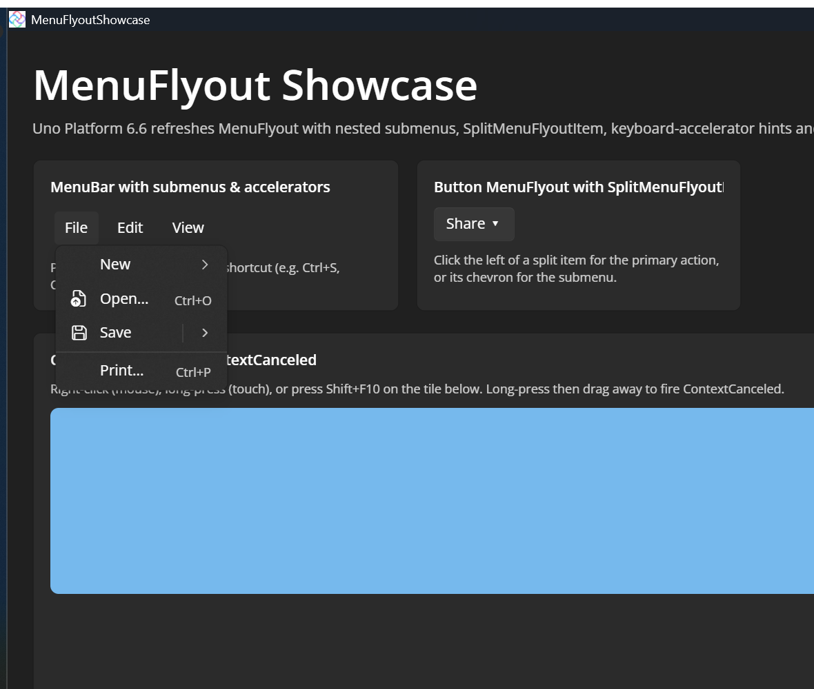

# MenuFlyout Showcase

A single-page Uno Platform 6.6 sample that demonstrates the refreshed menu experience: a `MenuBar` and a `Button.Flyout` full of nested submenus, `SplitMenuFlyoutItem`s, `ToggleMenuFlyoutItem`s and keyboard-accelerator hints, alongside an interactive tile that surfaces the new `ContextRequested` / `ContextCanceled` routed events with a live event log.

This sample brings together two Uno Platform 6.6 improvements:

- **MenuFlyout update, Flyout accelerators & `SplitMenuFlyoutItem`** — [PR #17292](https://github.com/unoplatform/uno/pull/17292)
- **`ContextRequested` and `ContextCanceled` routed events** — [PR #10002](https://github.com/unoplatform/uno/pull/10002)

## Features shown

- `MenuBar` / `MenuBarItem` with `MenuFlyoutSubItem` nested submenus.
- `SplitMenuFlyoutItem` — a primary click action on the left plus a chevron that opens a submenu (`.Items`).
- `ToggleMenuFlyoutItem` checkable entries.
- `KeyboardAccelerator` hints rendered on menu items (Ctrl+O, Ctrl+S, Ctrl+Z, F11, ...), including accelerators on items inside a `Flyout`.
- An element with a `ContextFlyout` opened via right-click, long-press, or Shift+F10.
- The new `ContextRequested` (with `TryGetPosition`) and `ContextCanceled` routed events, logged live.

## Codebase pointers

- `MainPage.xaml` — all menus and the context-flyout tile are declared inline in XAML.
- `MainPage.xaml.cs` — `Click`, `ContextRequested`, and `ContextCanceled` handlers plus the event log.

## What is Uno Platform?

[Uno Platform](https://platform.uno/) is the open-source .NET framework for building single-codebase applications for Windows, Web (WebAssembly), macOS, Linux, iOS, and Android using the WinUI 3 API.

Back to [all samples](../../README.md).
