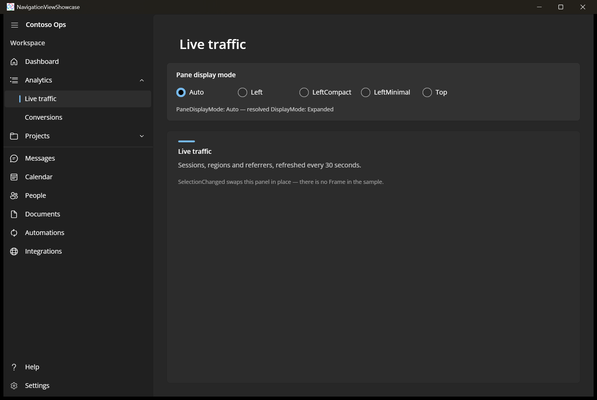

# NavigationView Showcase

An app shell built on [NavigationView](https://learn.microsoft.com/windows/windows-app-sdk/api/winrt/microsoft.ui.xaml.controls.navigationview), which Uno Platform re-ported 1:1 against current WinUI sources. The sample exercises the parts most apps use: a pane title and header, items with icons, hierarchical items with children, a separator, footer items including the auto-generated Settings entry, and a live switch between every `PaneDisplayMode` — Auto, Left, LeftCompact, LeftMinimal and Top — with the resolved `DisplayMode` reported underneath.

## Codebase

* [**MainPage.xaml**](src/NavigationViewShowcase/MainPage.xaml): The `NavigationView` shell, its menu and footer items, the hierarchical children, and the pane-mode picker.
* [**MainPage.xaml.cs**](src/NavigationViewShowcase/MainPage.xaml.cs): Handles `SelectionChanged` to swap the content panel, `DisplayModeChanged` to report the resolved mode, and applies the chosen `PaneDisplayMode`.
* [**NavigationViewShowcase.csproj**](src/NavigationViewShowcase/NavigationViewShowcase.csproj): Uno single-project configuration targeting Desktop and WebAssembly with the Skia renderer.

## Notes

The sample deliberately has no `Frame` and no navigation stack — selection swaps a panel in place — so it stays about the shell itself. Top-mode overflow depends on the window width: at around 1280&nbsp;px the trailing items collapse into the `...` overflow menu, while a maximized window on a large display fits them all.

## What is the Uno Platform

[Uno Platform](https://platform.uno) is an open-source .NET platform for building single codebase native mobile, web, desktop, and embedded apps quickly.
For additional information about Uno Platform or if you have any feedback to share, please refer to the [README.md](../../README.md) file in this Samples repository.
