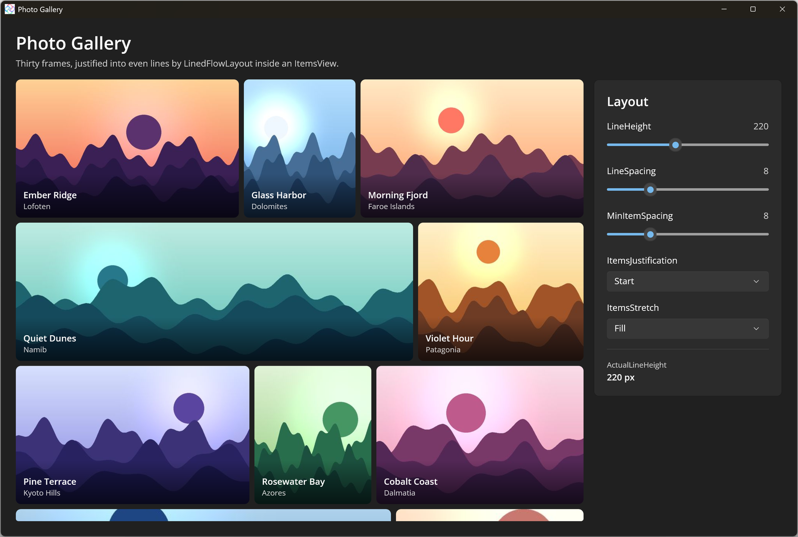

# Photo Gallery

This sample shows the new [LinedFlowLayout](https://learn.microsoft.com/windows/windows-app-sdk/api/winrt/microsoft.ui.xaml.controls.linedflowlayout) running on Uno Platform inside an [ItemsView](https://learn.microsoft.com/windows/windows-app-sdk/api/winrt/microsoft.ui.xaml.controls.itemsview). Thirty procedurally generated photos with portrait, landscape, square and panorama aspect ratios are justified into even lines. The aspect ratios are supplied through the `ItemsInfoRequested` event, and a settings panel changes `LineHeight`, `LineSpacing`, `MinItemSpacing`, `ItemsJustification` and `ItemsStretch` live. See the [Uno Platform docs](https://platform.uno/docs/articles/controls/ItemsView.html) for more on items controls.

## Codebase

- `src/PhotoGallery/MainPage.xaml` - the `ItemsView` with `LinedFlowLayout`, item template and settings panel
- `src/PhotoGallery/MainPage.xaml.cs` - `ItemsInfoRequested` handler and live setting changes
- `src/PhotoGallery/Photo.cs` - photo model and sample data
- `src/PhotoGallery/Assets/Photos` - generated sample images
- `src/PhotoGallery/App.xaml.cs` - app startup and window sizing

## What is the Uno Platform

[Uno Platform](https://platform.uno) is an open-source platform for building single codebase native mobile, web, desktop and embedded apps quickly.
