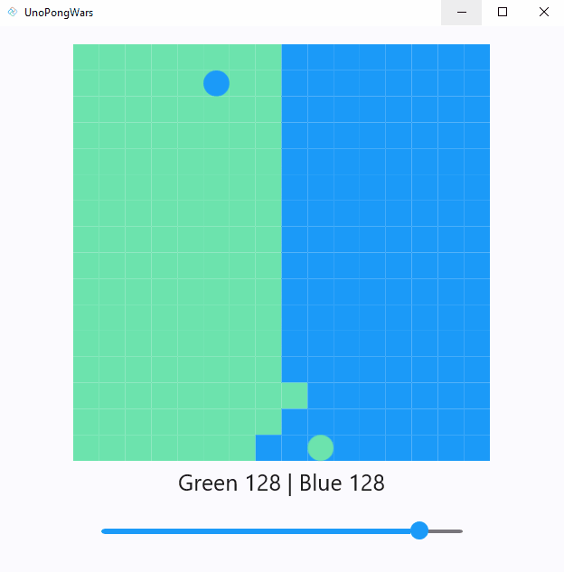
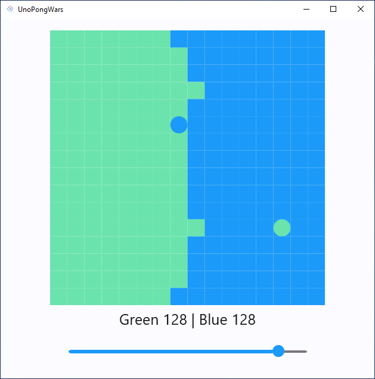
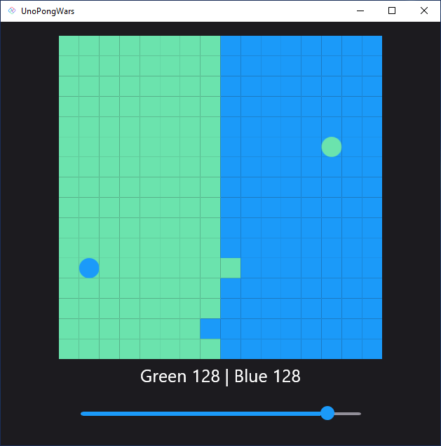
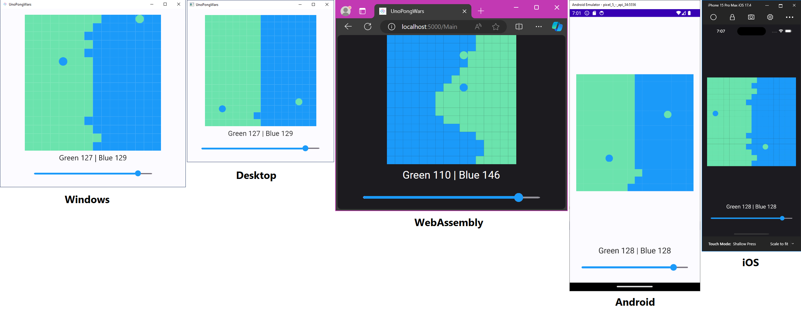

# Uno PongWars

Uno PongWars is a simple minigame that draws inspiration from the [PongWars HTML/JavaScript sample](https://github.com/vnglst/pong-wars). Set in the backdrop of the eternal conflict between day and night, good and bad.

The app harnesses the power of [Uno Platform](https://platform.uno) to run natively on the Web (via WebAssembly), Windows, Linux, Mac Catalyst, iOS, and Android.

[C# Markup](https://aka.platform.uno/csharp-markup) was used for the user interface. State management is facilitated by [MVUX](https://aka.platform.uno/mvux), a robust library that promotes the unidirectional flow of immutable data. [Records](https://learn.microsoft.com/en-us/dotnet/csharp/language-reference/builtin-types/record) are used to manage state and ensure immutability.

The game's theme is customized using Uno Platform colors through [Material Colors and Brushes](https://aka.platform.uno/material-colors), built with [Uno Platform Material 3.0 library](https://aka.platform.uno/material-getting-started) and supports [Light/Dark theme](https://aka.platform.uno/working-with-themes). Additionally, it includes a speed slider with Material theming, adding a touch of interactivity to the game.

## Codebase

* [**GamePage.cs**](src/UnoPongWars/Presentation/GamePage.cs): Defines the visual representation of the game using [C# Markup](https://aka.platform.uno/csharp-markup) syntax. It creates a ItemsRepeater layout containing the game board with cells and other UI elements such as TextBlock and Slider. The GamePage class binds UI elements to properties in the GameModel to reflect the game state visually. Additionally, it sets up color schemes and event handlers to interact with the game.
* [**GameModel.cs**](src/UnoPongWars/Presentation/GameModel.cs): Manages the game's state and behavior. It initializes the game's title, speed, cells, and score. The GameModel class also establishes the relationship between the game logic and the presentation layer. It utilizes [MVUX](https://aka.platform.uno/mvux) for state management, ensuring a clean separation of concerns between the UI and the underlying game logic.
* [**Game.cs**](src/UnoPongWars/Models/Game.cs): Contains the core logic of the game. It manages the game state, including the position and direction of the balls and the cells on the game board. The Game class implements game logic for ball movement, collisions with walls, and updating the game state. It utilizes records to manage state immutably, ensuring the integrity of the game state throughout the gameplay.
* [**Cell.cs**](src/UnoPongWars/Models/Cell.cs): Represents a single cell on the game board. Each cell has properties such as its position, player (green or blue), and whether it contains a ball. The Cell class is utilized in the game logic for collision detection and updating the game state.

## Screenshots

### Light Theme

### Dark Theme

### Different scaling and platforms

## What is the Uno Platform

[Uno Platform](https://platform.uno) is an open-source .NET platform for building single codebase native mobile, web, desktop, and embedded apps quickly.
For additional information about Uno Platform or if you have any feedback to share, please refer to the [README.md](../../README.md) file in this Samples repository.
