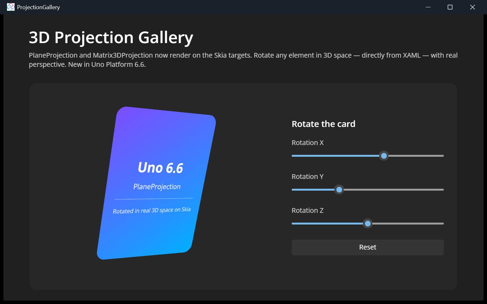
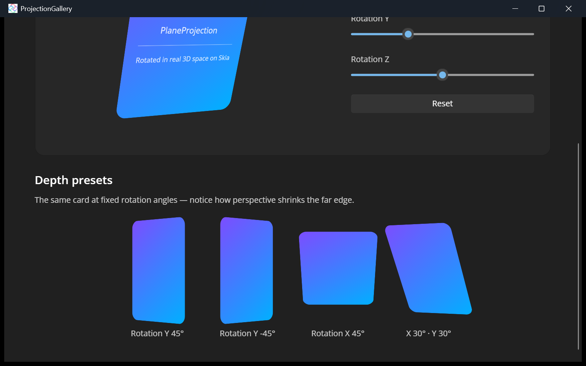

# 3D Projection Gallery

This sample showcases **`PlaneProjection`** and **`Matrix3DProjection`**, which now render on the [Uno Platform](https://platform.uno) **Skia** targets as of **Uno Platform 6.6** ([PR #22449](https://github.com/unoplatform/uno/pull/22449)).

Projections let you rotate and translate any `UIElement` in 3D space — with real perspective — directly from XAML, without writing any custom rendering code. Think flip cards, carousels, cover-flow effects, and subtle depth.



The app runs from a single C# + XAML codebase on the Web (WebAssembly) and Desktop (Windows, macOS, Linux) via the Skia renderer.

## Features shown

- **Interactive card** — three sliders drive the `PlaneProjection.RotationX` / `RotationY` / `RotationZ` of a card, so you can spin it in 3D live.
- **Depth presets** — the same card at fixed angles, making the perspective foreshortening obvious (the far edge shrinks).

## How it works

A `PlaneProjection` is attached to any element through the inherited `UIElement.Projection` property:

```xml
<Border Width="240" Height="320">
    <Border.Projection>
        <PlaneProjection x:Name="HeroProjection"
                         RotationX="{Binding Value, ElementName=RotX}"
                         RotationY="{Binding Value, ElementName=RotY}"
                         RotationZ="{Binding Value, ElementName=RotZ}" />
    </Border.Projection>
    <!-- card content -->
</Border>
```

The rotation values are two-way bound to `Slider` controls, so moving a slider rotates the card in real time. For full control you can instead use `Matrix3DProjection` and supply your own 4×4 `Matrix3D`.



## Codebase

* [**MainPage.xaml**](src/ProjectionGallery/MainPage.xaml): the entire UI — the interactive hero card, the rotation sliders, and the depth-preset gallery, all using `PlaneProjection`.
* [**MainPage.xaml.cs**](src/ProjectionGallery/MainPage.xaml.cs): a small `Reset` handler that returns the sliders to zero.

## What is the Uno Platform

[Uno Platform](https://platform.uno) is an open-source .NET platform for building single-codebase native mobile, web, desktop, and embedded apps quickly.
For additional information about Uno Platform or if you have any feedback to share, please refer to the [README.md](../../README.md) file in this Samples repository.
