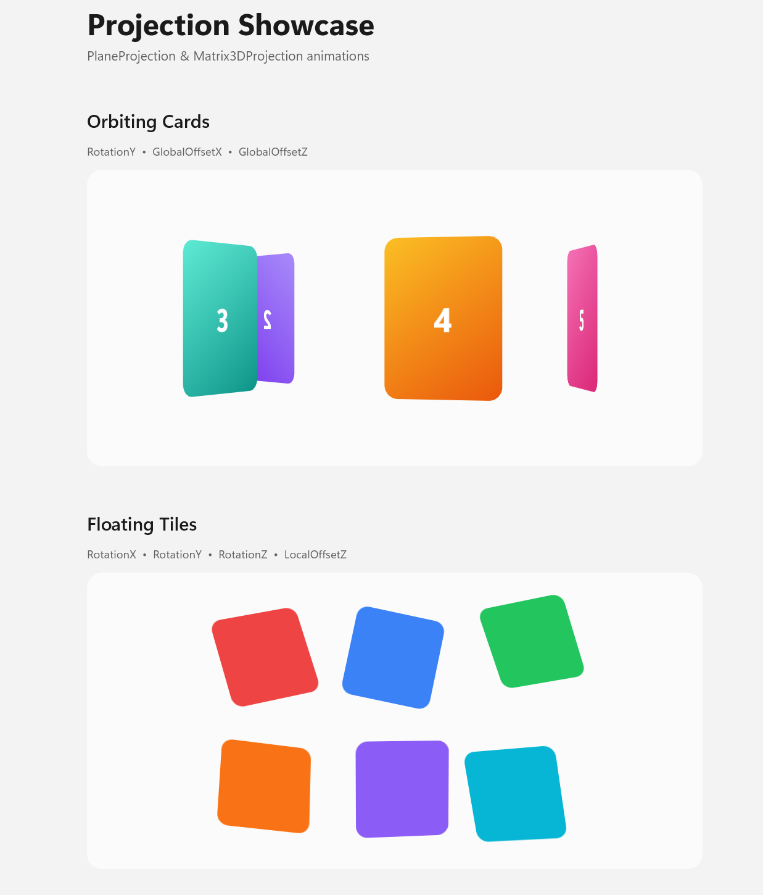

# Projection Showcase

Demonstrates 3D projection and animation capabilities in Uno Platform using [PlaneProjection](https://learn.microsoft.com/en-us/windows/windows-app-sdk/api/winrt/microsoft.ui.xaml.media.planeprojection) and [Matrix3DProjection](https://learn.microsoft.com/en-us/windows/windows-app-sdk/api/winrt/microsoft.ui.xaml.media.matrix3dprojection). Five animated scenes illustrate rotation, depth, and perspective effects driven by `CompositionTarget.Rendering`.

## Codebase

* [**MainPage.xaml**](src/ProjectionShowcase/MainPage.xaml): Defines all five animation sections — Orbiting Cards, Floating Tiles, Flip Card, Perspective Tunnel, and Matrix3D Wave — using `PlaneProjection` and `Matrix3DProjection` elements attached to styled `Border` containers.
* [**MainPage.xaml.cs**](src/ProjectionShowcase/MainPage.xaml.cs): Implements the animation logic using `CompositionTarget.Rendering`. Each frame updates rotation angles, global/local offsets, visibility toggles, and custom `Matrix3D` values across all five scenes.
* [**ProjectionShowcase.csproj**](src/ProjectionShowcase/ProjectionShowcase.csproj): Uno single-project configuration targeting Android, iOS, Windows, WebAssembly, and Desktop with the Skia renderer.

## What is the Uno Platform

[Uno Platform](https://platform.uno) is an open-source .NET platform for building single codebase native mobile, web, desktop, and embedded apps quickly.
For additional information about Uno Platform or if you have any feedback to share, please refer to the [README.md](../../README.md) file in this Samples repository.
