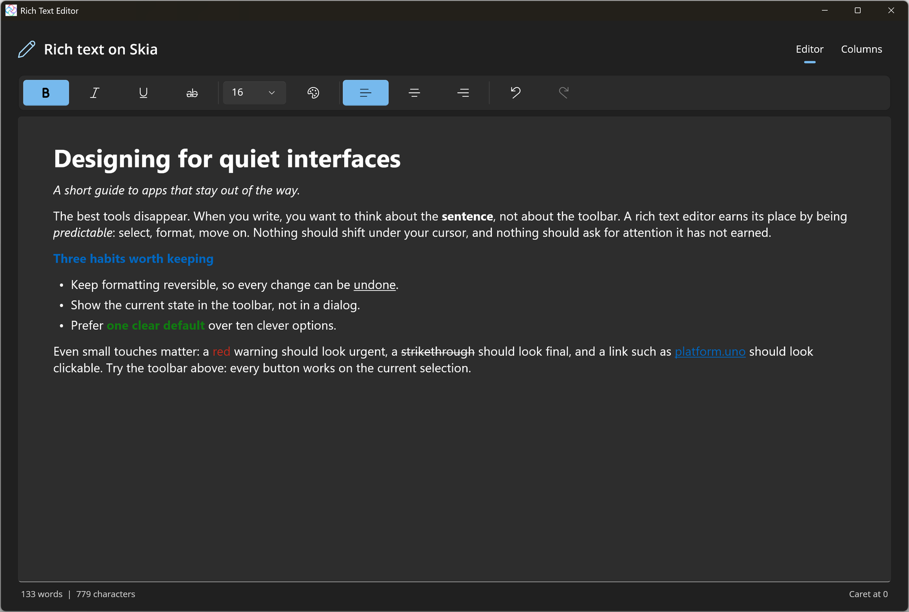

# Rich Text Editor

This sample shows the rich text controls that Uno Platform 7.0 brings to every Skia-rendered target. The **Editor** page hosts a [RichEditBox](https://learn.microsoft.com/windows/windows-app-sdk/api/winrt/microsoft.ui.xaml.controls.richeditbox) loaded from RTF, with a `CommandBar` that drives the selection through [`Document.Selection`](https://learn.microsoft.com/windows/windows-app-sdk/api/winrt/microsoft.ui.text.itextselection) (`CharacterFormat` and `ParagraphFormat`), plus undo/redo and a live word count. The **Columns** page flows a single [RichTextBlock](https://learn.microsoft.com/windows/windows-app-sdk/api/winrt/microsoft.ui.xaml.controls.richtextblock) through two [RichTextBlockOverflow](https://learn.microsoft.com/windows/windows-app-sdk/api/winrt/microsoft.ui.xaml.controls.richtextblockoverflow) columns, with text selection that spans columns and a [TextHighlighter](https://learn.microsoft.com/windows/windows-app-sdk/api/winrt/microsoft.ui.xaml.documents.texthighlighter). See the [RichEditBox article](https://platform.uno/docs/articles/controls/RichEditBox.html) for the Uno specifics.

## Codebase

- `src/RichTextEditor/MainPage.xaml` - the `SelectorBar`, the formatting `CommandBar`, the `RichEditBox` and the three-column `RichTextBlock` layout.
- `src/RichTextEditor/MainPage.xaml.cs` - RTF loading, toolbar-to-selection formatting, status line, article content, `TextHighlighter` and cross-column selection.
- `src/RichTextEditor/App.xaml.cs` - window creation and sizing.

## What is the Uno Platform

[Uno Platform](https://platform.uno) is an open-source platform for building single codebase native mobile, web, desktop and embedded apps quickly.
