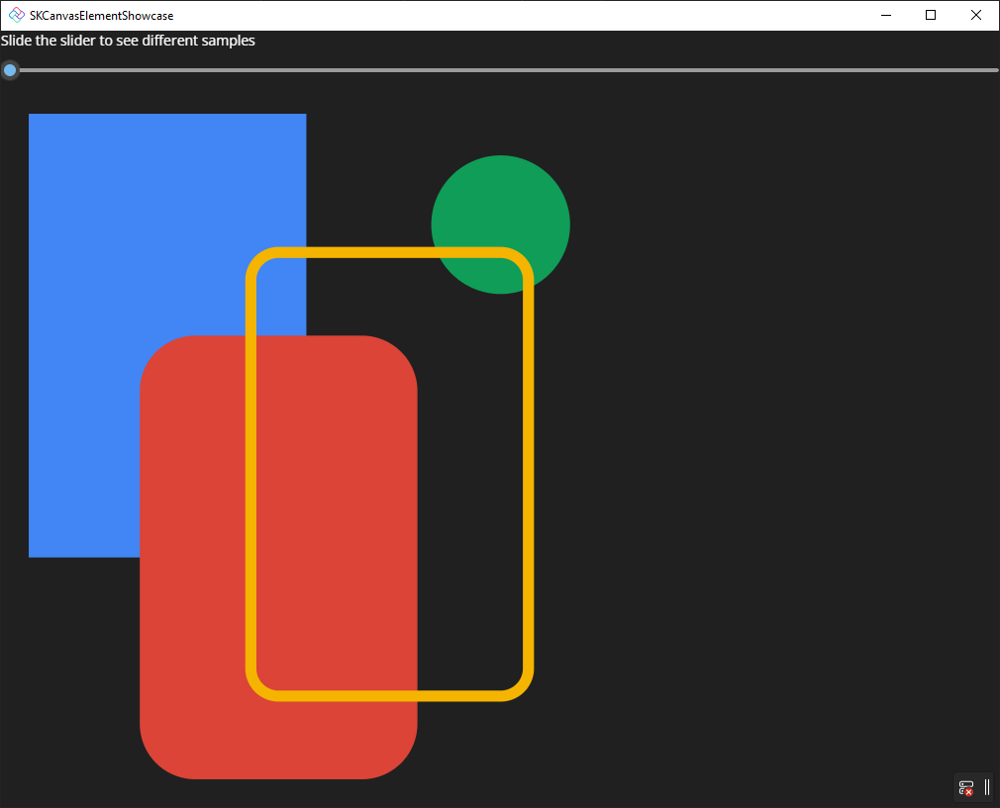

# SKCanvasElementShowcase

This sample shows how to use `SKCanvasElement`. The sample contains a `Slider` that slides between different Skia drawings. 

For more information, [read our docs](https://aka.platform.uno/skcanvaselement).
