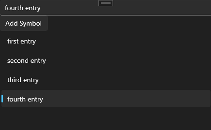

# SQLite Sample

This is a simple standalone app demonstrating the use of SQLite in an Uno application, including WebAssembly. It uses Erik Sink's [SQLitePCLRaw](https://github.com/ericsink/SQLitePCL.raw), and Frank Krueger's [sqlite-net](https://github.com/praeclarum/sqlite-net) libraries.

The WebAssembly application uses the [Uno.SQLitePCLRaw.Wasm](https://github.com/unoplatform/Uno.SQLitePCLRaw.Wasm) package to provide an in-browser, client-side SQLite database.

## Codebase

* [**MainPage.xaml.cs**](src/SQLiteSample/MainPage.xaml.cs): Connects the client to the local [SQLite](https://www.sqlite.org/) instance.

## What is the Uno Platform

[Uno Platform](https://platform.uno) is an open-source .NET platform for building single codebase native mobile, web, desktop, and embedded apps quickly.
For additional information about Uno Platform or if you have any feedback to share, please refer to the [README.md](../../README.md) file in this Samples repository.