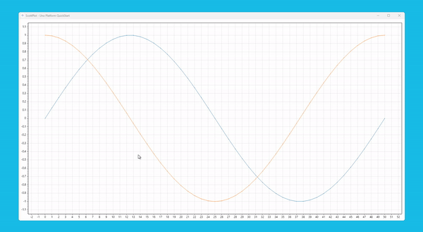
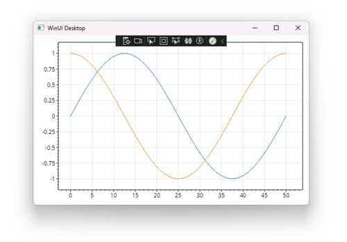
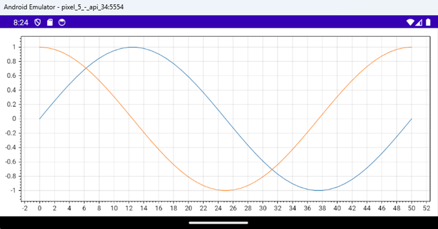
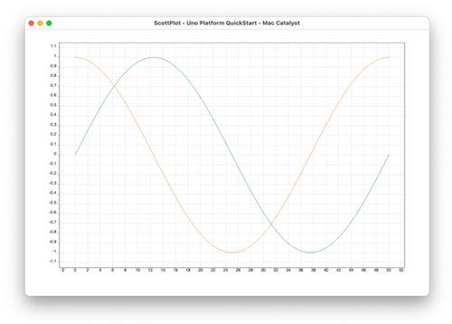
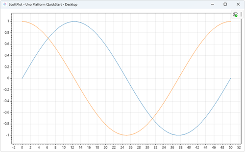
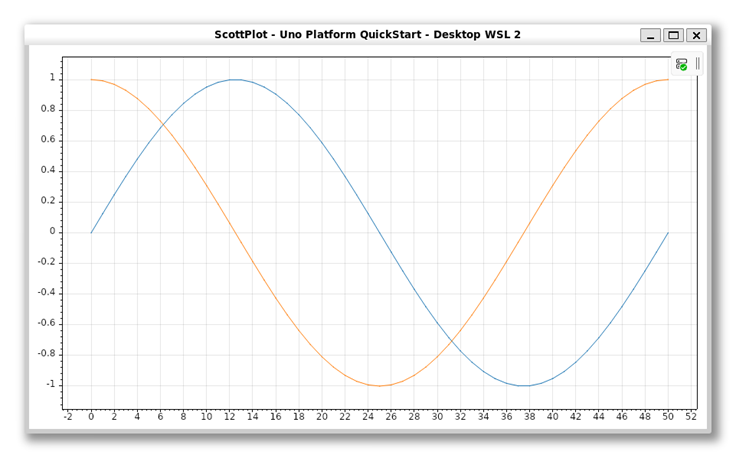

# ScottPlot Samples

[ScottPlot](https://scottplot.net/) is a free and open-source plotting library for .NET that makes it easy to interactively display large datasets. Line plots, bar charts, pie graphs, scatter plots, and more can be created with just a few lines of code.

## Quickstart sample

[This sample](/QuickstartSample/) app was created by following the [ScottPlot Uno Platform Quickstart documentation](https://scottplot.net/quickstart/unoplatform).

### Screenshots

| | | |
|:-------------------------:|:-------------------------:|:-------------------------:|
|  **Windows** |   **WebAssembly** | **Android** |
| **iOS** |   **Mac Catalyst** | **Desktop** |
| **Desktop WSL** | | |

## Signal plot with 5 million points sample

[This sample](/SignalPlotFiveMillionPointsSample/) app was created the same way by following the [ScottPlot Uno Platform Quickstart documentation](https://scottplot.net/quickstart/unoplatform). Only the code-behind defers to display a signal plot with 5 million random points.

## What is the Uno Platform

[Uno Platform](https://platform.uno) is an open-source .NET platform for building single codebase native mobile, web, desktop, and embedded apps quickly.
For additional information about Uno Platform or if you have any feedback to share, please refer to the [README.md](../../README.md) file in this Samples repository.

## ScottPlot Support

If you have questions about the open-source ScottPlot plotting library:

* ScottPlot website: [https://scottplot.net/](https://scottplot.net/)
* ScottPlot on GitHub: [create an issue](https://github.com/ScottPlot/ScottPlot/issues) or [start a discussion](https://github.com/ScottPlot/ScottPlot/discussions)
* [ScottPlot Discord Server](https://discord.gg/Dru6fnY2UX) (All are welcome!)
