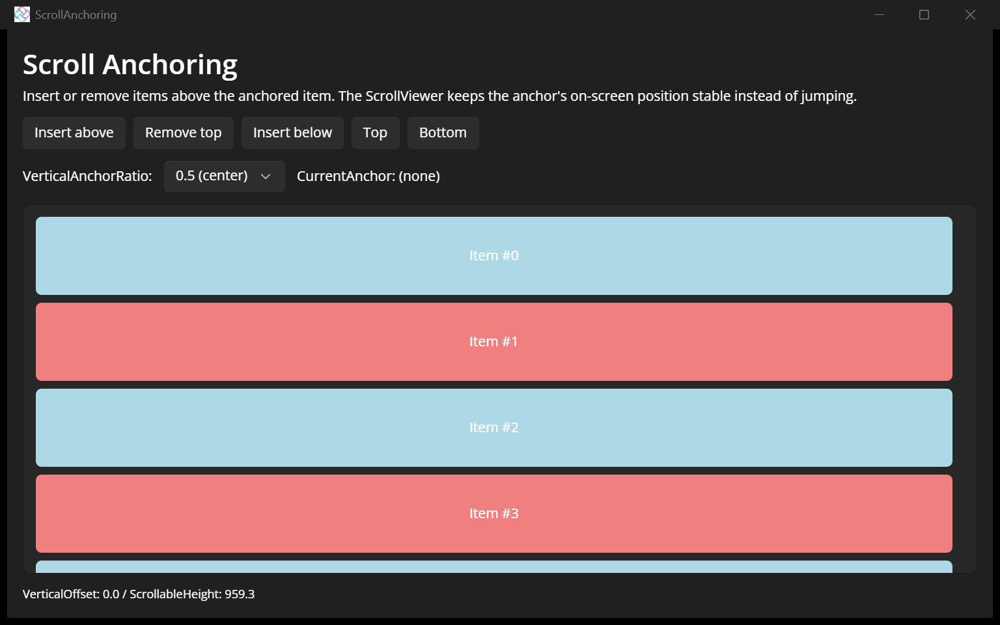

# Scroll Anchoring

This sample demonstrates **scroll anchoring** on the [Uno Platform](https://platform.uno) `ScrollViewer`, new on the Skia targets in **Uno Platform 6.6** ([PR #23053](https://github.com/unoplatform/uno/pull/23053)).

When items are inserted or removed **above** the currently anchored item, the `ScrollViewer` keeps the anchor's on-screen position stable instead of letting the content jump — the classic chat / live-log scenario.

## Features shown

- `RegisterAnchorCandidate` / `UnregisterAnchorCandidate` — register live descendants as anchor candidates (on `Loaded` / `Unloaded`).
- `CurrentAnchor` — read the element the viewport is currently anchored to (shown live).
- `VerticalAnchorRatio` — choose which point of the viewport (top `0.0`, center `0.5`, bottom `1.0`) is preserved.
- Insert-above / remove-top / insert-below buttons to show the anchored item staying put.

The visible position-preservation effect runs through the managed `ScrollContentPresenter` pipeline (Skia + WebAssembly).

## Codebase

- **[MainPage.xaml](src/ScrollAnchoring/MainPage.xaml)**: the chat/log-style `ScrollViewer`, the anchor-ratio picker, and the mutation buttons.
- **[MainPage.xaml.cs](src/ScrollAnchoring/MainPage.xaml.cs)**: registers/unregisters anchor candidates and updates the live `CurrentAnchor` / offset readout.

## What is the Uno Platform

[Uno Platform](https://platform.uno) is an open-source .NET platform for building single-codebase native mobile, web, desktop, and embedded apps quickly.
For additional information about Uno Platform or if you have any feedback to share, please refer to the [README.md](../../README.md) file in this Samples repository.
