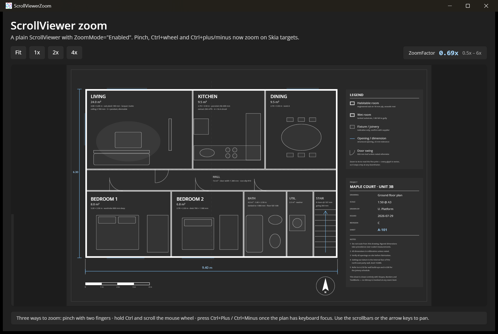

# ScrollViewer Zoom

Demonstrates zoom support in [ScrollViewer](https://learn.microsoft.com/windows/windows-app-sdk/api/winrt/microsoft.ui.xaml.controls.scrollviewer) on Uno Platform's Skia targets. A vector floor plan — drawn entirely with `Shapes`, `Border`s and `TextBlock`s, no bitmap at any zoom level — sits inside a plain `ScrollViewer` with `ZoomMode="Enabled"`, `MinZoomFactor="0.5"` and `MaxZoomFactor="6"`. Zoom with a pinch gesture, with Ctrl + mouse wheel, or with Ctrl+Plus / Ctrl+Minus, and jump to preset factors with `ChangeView`.

## Codebase

* [**MainPage.xaml**](src/ScrollViewerZoom/MainPage.xaml): The zoom-enabled `ScrollViewer`, the Fit / 1x / 2x / 4x toolbar, the live `ZoomFactor` readout, and the floor plan itself.
* [**MainPage.xaml.cs**](src/ScrollViewerZoom/MainPage.xaml.cs): Handles `ViewChanged` to update the readout, and calls `ChangeView(null, null, factor)` for the presets and a computed fit-to-window factor for Fit.
* [**ScrollViewerZoom.csproj**](src/ScrollViewerZoom/ScrollViewerZoom.csproj): Uno single-project configuration targeting Desktop and WebAssembly with the Skia renderer.

## Notes

Ctrl+Plus / Ctrl+Minus require the plan to have keyboard focus, so the toolbar buttons return focus to it after changing the view. Zoom is implemented in the managed scroll presenter used by the Skia targets; the WebAssembly DOM renderer and the native Android/iOS `ScrollViewer` do not support it.

## What is the Uno Platform

[Uno Platform](https://platform.uno) is an open-source .NET platform for building single codebase native mobile, web, desktop, and embedded apps quickly.
For additional information about Uno Platform or if you have any feedback to share, please refer to the [README.md](../../README.md) file in this Samples repository.
