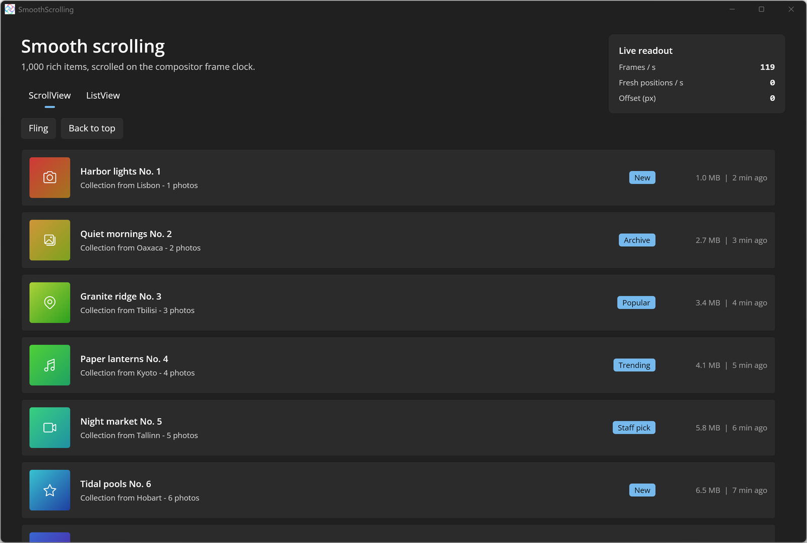

# Smooth Scrolling

This sample compares scrolling a feed of 1,000 rich items (gradient thumbnail, title, subtitle, badge) in the new WinUI [ScrollView](https://learn.microsoft.com/windows/windows-app-sdk/api/winrt/microsoft.ui.xaml.controls.scrollview) (driven by an `InteractionTracker`) with the classic [ScrollViewer](https://learn.microsoft.com/uwp/api/windows.ui.xaml.controls.scrollviewer) inside a `ListView`. A [SelectorBar](https://learn.microsoft.com/windows/windows-app-sdk/api/winrt/microsoft.ui.xaml.controls.selectorbar) switches between them. A live readout shows frames per second (from [CompositionTarget.Rendering](https://learn.microsoft.com/uwp/api/windows.ui.xaml.media.compositiontarget.rendering)) and the number of distinct scroll offsets observed per second. The "Fling" and "Back to top" buttons produce repeatable scrolling without touch input. See the [Uno Platform docs](https://platform.uno/docs/) for more.

## Codebase

- `src/SmoothScrolling/MainPage.xaml` - selector bar, readout panel, `ScrollView` + `ItemsRepeater`, `ListView`, shared item template
- `src/SmoothScrolling/MainPage.xaml.cs` - frame/offset counters, `AddScrollVelocity` / `ScrollTo` / `ChangeView` demo actions
- `src/SmoothScrolling/FeedItem.cs` - procedurally generated sample data and gradient thumbnails

## What is the Uno Platform

[Uno Platform](https://platform.uno) is an open-source platform for building single codebase native mobile, web, desktop and embedded apps quickly.
