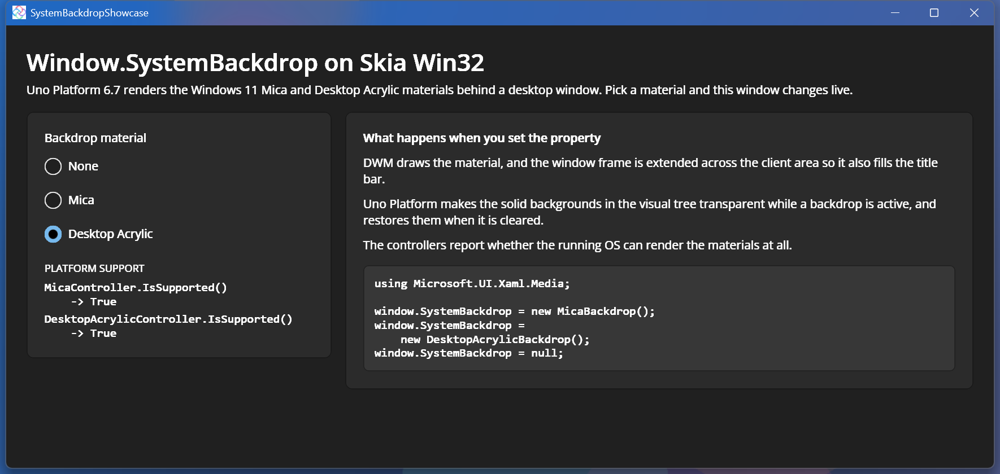

# System Backdrop Showcase

Demonstrates [Window.SystemBackdrop](https://learn.microsoft.com/windows/windows-app-sdk/api/winrt/microsoft.ui.xaml.window.systembackdrop) on Uno Platform's Skia Win32 target. Pick None, [MicaBackdrop](https://learn.microsoft.com/windows/windows-app-sdk/api/winrt/microsoft.ui.xaml.media.micabackdrop) or [DesktopAcrylicBackdrop](https://learn.microsoft.com/windows/windows-app-sdk/api/winrt/microsoft.ui.xaml.media.desktopacrylicbackdrop) and the running window switches material live. The sample also reports what `MicaController.IsSupported()` and `DesktopAcrylicController.IsSupported()` return on the current OS.

## Codebase

* [**MainPage.xaml**](src/SystemBackdropShowcase/MainPage.xaml): The material picker, the platform-support readout, and the explanation of what setting the property does.
* [**MainPage.xaml.cs**](src/SystemBackdropShowcase/MainPage.xaml.cs): Assigns `Window.SystemBackdrop` on the app's main window and reads the controllers' `IsSupported()` results.
* [**SystemBackdropShowcase.csproj**](src/SystemBackdropShowcase/SystemBackdropShowcase.csproj): Uno single-project configuration targeting Desktop and WebAssembly with the Skia renderer.

## Notes

The materials require **Windows 11 build 22621 or later** — `IsSupported()` returns `false` below that and setting a backdrop is a no-op. How obvious the effect is depends on what is behind and around the window: over a dark desktop with a dark app theme the tint is subtle, while Desktop Acrylic over colourful content is unmistakable.

## What is the Uno Platform

[Uno Platform](https://platform.uno) is an open-source .NET platform for building single codebase native mobile, web, desktop, and embedded apps quickly.
For additional information about Uno Platform or if you have any feedback to share, please refer to the [README.md](../../README.md) file in this Samples repository.
