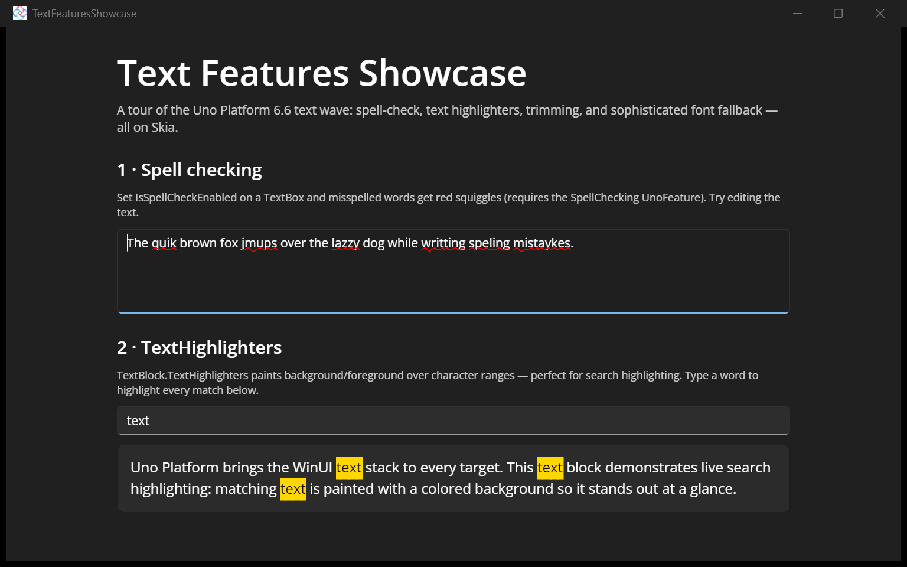
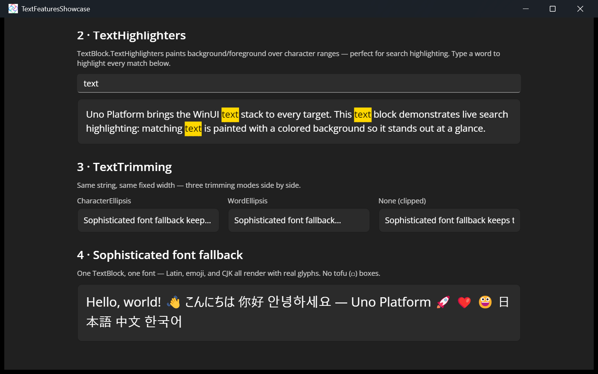

# Text Features Showcase

A single-page [Uno Platform](https://platform.uno) app that demonstrates the **text-rendering wave** shipped in **Uno Platform 6.6**, all running on the Skia rendering engine.

## Features shown

- **TextBox spell checking** ([PR #22383](https://github.com/unoplatform/uno/pull/22383)) — `IsSpellCheckEnabled` draws red squiggles under misspelled words.
- **TextBlock TextHighlighters** ([PR #22448](https://github.com/unoplatform/uno/pull/22448)) — paint live search matches over character ranges as you type.
- **TextBlock TextTrimming** ([PR #22572](https://github.com/unoplatform/uno/pull/22572)) — `CharacterEllipsis`, `WordEllipsis` and `None` compared side by side at a fixed width.
- **Sophisticated font fallback** ([PR #22240](https://github.com/unoplatform/uno/pull/22240)) — one `TextBlock` mixing Latin, color emoji and CJK, all with real glyphs and no missing-glyph (tofu) boxes.

## Codebase

* [**MainPage.xaml**](src/TextFeaturesShowcase/MainPage.xaml): the full single-page UI — one section per 6.6 feature, themed with `{ThemeResource}` brushes so it works in light and dark.
* [**MainPage.xaml.cs**](src/TextFeaturesShowcase/MainPage.xaml.cs): the live `TextHighlighter` search over character ranges.

## Requirements

- Spell checking requires the **`SpellChecking`** `<UnoFeatures>` entry in the project file (pulls in the `Uno.WinUI.SpellChecking` package).

## What is the Uno Platform

[Uno Platform](https://platform.uno) is an open-source .NET platform for building single-codebase native mobile, web, desktop, and embedded apps quickly.
For additional information about Uno Platform or if you have any feedback to share, please refer to the [README.md](../../README.md) file in this Samples repository.
