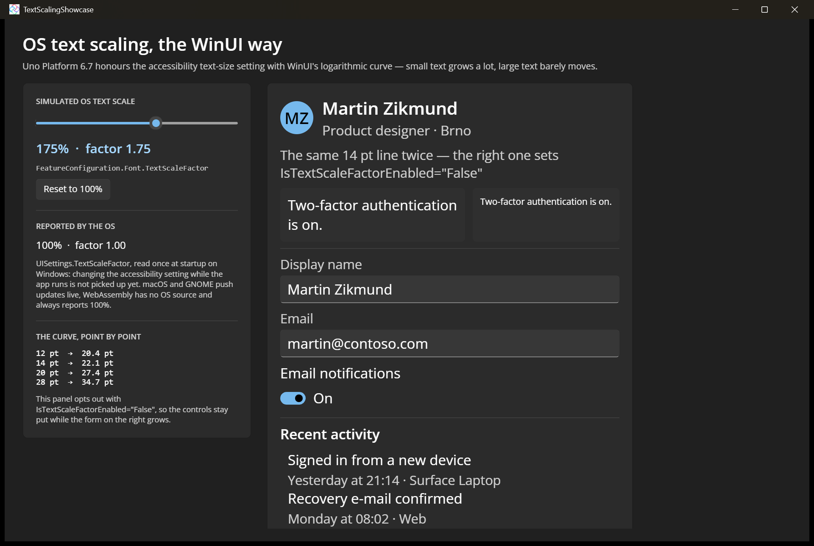

# Text Scaling Showcase

Demonstrates OS text-scaling (accessibility) support in Uno Platform, which follows WinUI's logarithmic curve — small text grows a lot, large text barely moves, so layouts degrade gracefully instead of exploding. A profile form grows with the scale factor while a side-by-side line with [IsTextScaleFactorEnabled](https://learn.microsoft.com/windows/windows-app-sdk/api/winrt/microsoft.ui.xaml.controls.textblock.istextscalefactorenabled)`="False"` stays put, and the panel prints the curve point by point.

## Codebase

* [**MainPage.xaml**](src/TextScalingShowcase/MainPage.xaml): The scale slider, the OS-reported value, the curve readout, and the profile form that grows.
* [**MainPage.xaml.cs**](src/TextScalingShowcase/MainPage.xaml.cs): Drives `Uno.UI.FeatureConfiguration.Font.TextScaleFactor` from the slider and subscribes to `UISettings.TextScaleFactorChanged` for the OS value.
* [**TextScaleCurve.cs**](src/TextScalingShowcase/TextScaleCurve.cs): Mirrors WinUI's scaling formula purely to print the ladder — the framework does its own scaling.
* [**TextScalingShowcase.csproj**](src/TextScalingShowcase/TextScalingShowcase.csproj): Uno single-project configuration targeting Desktop and WebAssembly with the Skia renderer.

## Notes

The slider drives the in-app `FeatureConfiguration` override so the effect can be demonstrated without changing OS settings; the real OS-reported value is shown separately. On **Windows** the OS value is read once at startup, so changing the accessibility slider while the app runs is not picked up yet. **macOS** and **GNOME** push changes live. **WebAssembly** has no OS text-scale source and always reports 100%.

## What is the Uno Platform

[Uno Platform](https://platform.uno) is an open-source .NET platform for building single codebase native mobile, web, desktop, and embedded apps quickly.
For additional information about Uno Platform or if you have any feedback to share, please refer to the [README.md](../../README.md) file in this Samples repository.
