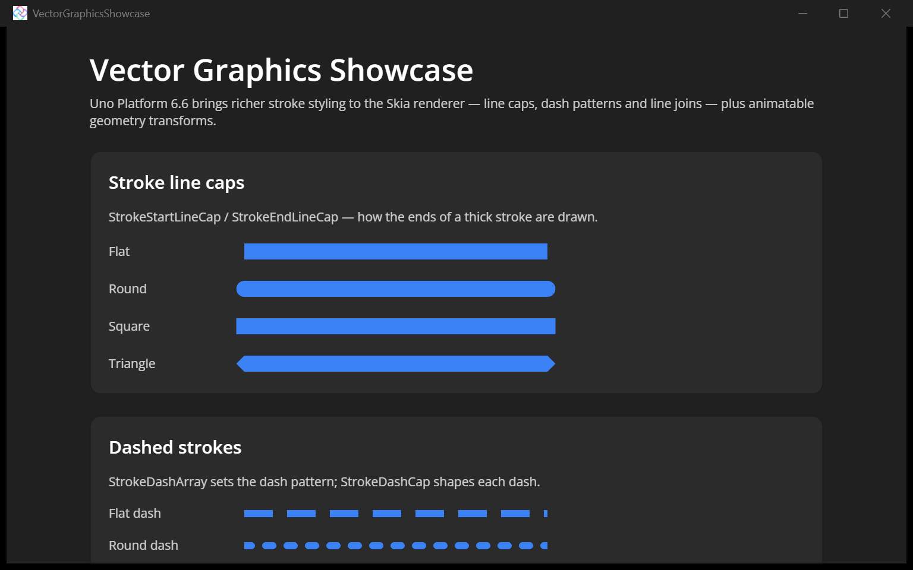
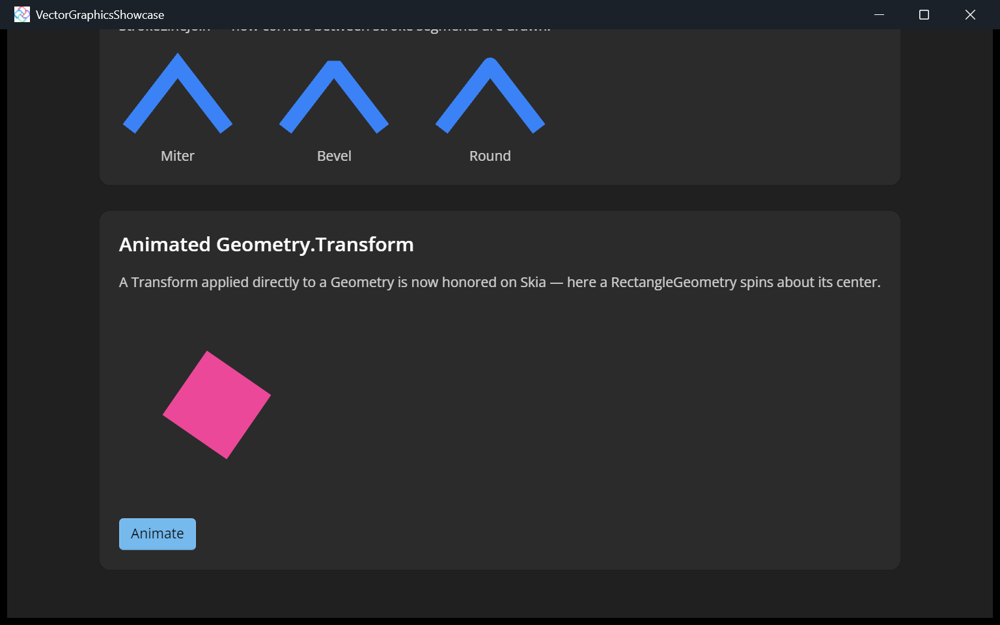

# Vector Graphics Showcase

This sample shows the richer **vector stroke styling** that the [Uno Platform](https://platform.uno) Skia renderer gained in **Uno Platform 6.6**, plus **animatable geometry transforms**.

## Features shown

- **Stroke line caps** ([PR #22717](https://github.com/unoplatform/uno/pull/22717)) — `StrokeStartLineCap` / `StrokeEndLineCap` rendered as Flat, Round, Square and Triangle.
- **Dashed strokes** ([PR #22717](https://github.com/unoplatform/uno/pull/22717)) — `StrokeDashArray` dash patterns with Flat and Round `StrokeDashCap`, and a dashed rounded rectangle.
- **Line joins** ([PR #22717](https://github.com/unoplatform/uno/pull/22717)) — `StrokeLineJoin` rendered as Miter, Bevel and Round.
- **Animated `Geometry.Transform`** ([PR #22620](https://github.com/unoplatform/uno/pull/22620)) — a `Transform` applied directly to a `RectangleGeometry` is now honored on Skia; here it spins about its center, driven by a `Storyboard`.

## Codebase

- **[MainPage.xaml](src/VectorGraphicsShowcase/MainPage.xaml)**: the cap / dash / join galleries (shapes hosted in fixed-size `Canvas` panels) and the `RectangleGeometry` with a `RotateTransform` in its `Transform`.
- **[MainPage.xaml.cs](src/VectorGraphicsShowcase/MainPage.xaml.cs)**: the `Storyboard` that animates the geometry's rotation, with a toggle to pause/resume.

## What is the Uno Platform

[Uno Platform](https://platform.uno) is an open-source .NET platform for building single-codebase native mobile, web, desktop, and embedded apps quickly.
For additional information about Uno Platform or if you have any feedback to share, please refer to the [README.md](../../README.md) file in this Samples repository.
