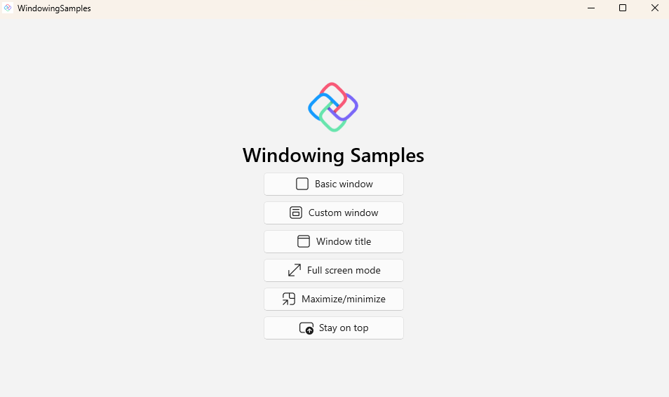

# Windowing Samples

This sample showcases various windowing APIs in Uno Platform a .NET project focused on demonstrating various window management techniques. This project includes examples of custom windows, full-screen mode, minimizing and maximizing windows, and more. It provides a comprehensive guide for developers looking to implement advanced windowing features in their .NET applications.

Most windowing features are currently available on desktop targets of [Uno Platform](https://platform.uno) only (Windows, macOS, and Linux).

## Codebase

* [**CustomWindow.xaml & CustomWindow.xaml.cs**](src/WindowingSamples/CustomWindow.xaml.cs): Implementation of a custom window type.
* [**FullScreenModeWindow.xaml & FullScreenModeWindow.xaml.cs**](src/WindowingSamples/FullScreenModeWindow.xaml.cs): Window set to display in full-screen mode.
* [**MinimizeMaximizeWindow.xaml & MinimizeMaximizeWindow.xaml.cs**](src/WindowingSamples/MinimizeMaximizeWindow.xaml.cs): Minimizing and maximizing a window.
* [**StayOnTopWindow.xaml & StayOnTopWindow.xaml.cs**](src/WindowingSamples/StayOnTopWindow.xaml.cs): Window that always stays on top of other content.
* [**WindowTitleWindow.xaml & WindowTitleWindow.xaml.cs**](src/WindowingSamples/WindowTitleWindow.xaml.cs): Customizing the Window title.

## What is the Uno Platform

[Uno Platform](https://platform.uno) is an open-source .NET platform for building single codebase native mobile, web, desktop, and embedded apps quickly.
For additional information about Uno Platform or if you have any feedback to share, please refer to the [README.md](../../README.md) file in this Samples repository.
