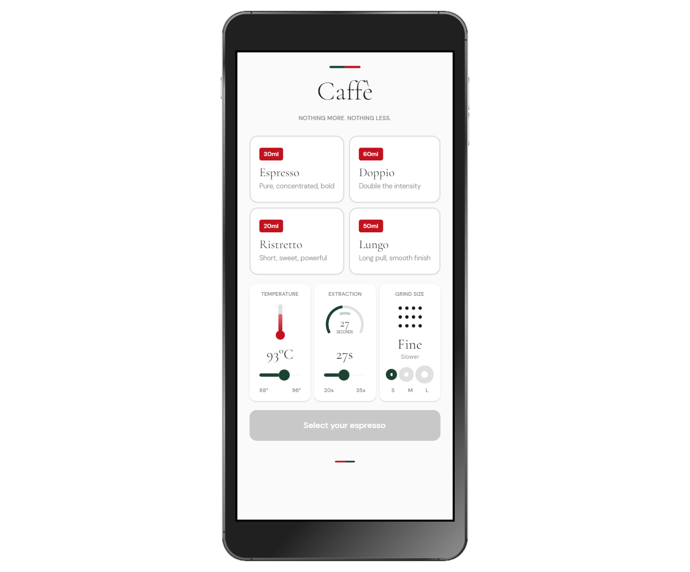

# ☕ Caffe — *Nothing more. Nothing less.*

> A single-page espresso brew configurator: pick a shot, dial in temperature / grind / extraction, and watch the cup fill.




## What you get
A focused, brand-led showcase of **type-scale discipline and responsive *controls*** (not just responsive shells). The thermometer, extraction arc, and grind-particle visuals are drawn entirely from XAML primitives — no SVG, no PNG.

## Highlights
- **Responsive controls** — `utu:Responsive` reflows the card grid and right panel; inner gauges adapt thumb sizes, padding, and slider widths between mobile and desktop.
- **Type-scale discipline** — every text element resolves through `CaffeFontSize*` tokens; zero raw `FontSize` on `TextBlock`.
- **Material + brand identity** — brand colors via `ColorPaletteOverride.xaml`, brand brushes alias Material tokens for a single source of truth.
- **`SafeArea Insets="VisibleBounds"`** at the root for notch / status-bar safety on mobile.

## Stack & platforms
**MVVM** (CommunityToolkit.Mvvm) · `IHostBuilder` + DI + region nav · Uno.Sdk 6.5.36 · `net10.0-desktop` ✅, `net10.0-android` (declared)

## Run it
```powershell
dotnet run --project Caffe/Caffe.csproj -f net10.0-desktop
```
