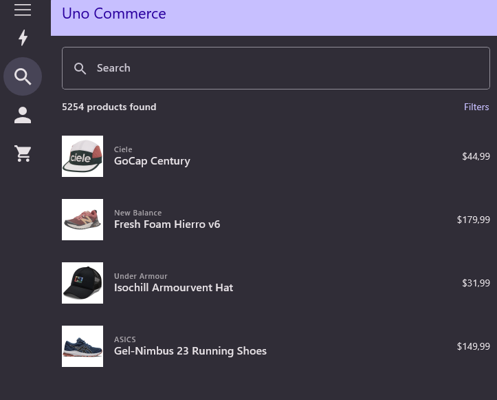

# Commerce

 Commerce is a sample application that demonstrates the use of ListFeed pagination, Feedviews, and other features provided by Uno.Extensions. It illustrates how these features can be applied to create an application complete with a shopping cart, products, and more.

## Codebase

### ListFeed

* [**ProductsViewModel.cs**](src/Commerce/Presentation/ProductsViewModel.cs) 
* [**ProductsPage.xaml**](src/Commerce/Views/ProductsPage.xaml)

### Pagination

* [**DealsViewModel.cs**](src/Commerce/Presentation/DealsViewModel.cs) 
* [**DealsPage.xaml**](src/Commerce/Views/DealsPage.xaml)

### MVUX

* [**ProductDetailsViewModel.cs**](src/Commerce/Presentation/ProductDetailsViewModel.cs)
* [**ProductControl.xaml**](src/Commerce/Views/ProductControl.xaml)

### Theming

* [**ProfileViewModel.cs**](src/Commerce/Presentation/ProfileViewModel.cs) 

### Command Builder

* [**LoginViewModel.cs**](src/Commerce/Presentation/LoginViewModel.cs)

## What is the Uno Platform

[Uno Platform](https://platform.uno) is an open-source .NET platform for building single codebase native mobile, web, desktop, and embedded apps quickly.
For additional information about Uno Platform or if you have any feedback to share, please refer to the [README.md](../../README.md) file in this Samples repository.