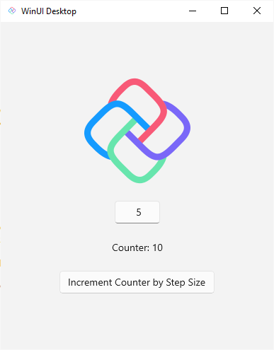

# Counter App

Discover the simplicity and power of Uno.Extensions with the Counter App, a straightforward yet powerful demonstration of basic and advanced features of the Uno Platform. This app provides a hands-on experience with fundamental concepts such as state management, user interaction, and UI updates in real-time.
This sample app was built using the four variants of the [Counter workshop](https://aka.platform.uno/counter-tutorial), combining markup language (XAML or C# Markup) and presentation framework (MVVM or MVUX).

[Browse source](https://github.com/unoplatform/Uno.Samples/tree/master/reference/Counter)

