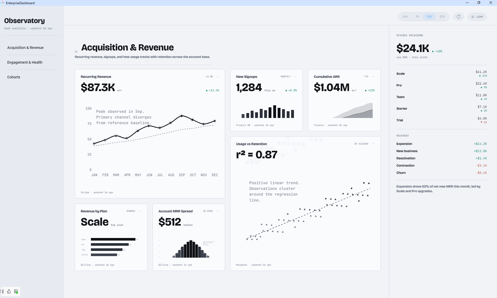

# 📊 EnterpriseDashboard — *"Observatory"*

> A monochromatic, identity-driven SaaS analytics dashboard. Three sections — Acquisition, Engagement, Cohorts — each a bento grid of hand-built Skia charts.




## What you get
The reference sample for **custom Skia charting and editorial bento composition**. 14 charts rendered from scratch — no charting library — with a typographic identity that reads like a print spread.

## Highlights
- **14 custom Skia charts** in `Observatory/Charts/` via pure `SKCanvasElement` — line, bar, stacked-bar, sparkline, distribution, slope, heatmap, ring, dot-plot.
- **Bento composition with intent** — tile sizes chosen per chart (MRR line is a 2×2 hero; cohort triangle spans full-row); composition is editorial, not generic-grid.
- **Identity typography** — Bricolage Grotesque + JetBrains Mono with characterful negative letter-spacing on display sizes.
- **Theme-aware brightness mapping** — the cohort heatmap mirrors luminance across Light / Dark so the same data reads correctly in both.
- **Scroll-triggered chart animation** — charts defer their reveal until they enter the viewport.

## Stack & platforms
**MVVM-style VMs** + region nav (NavigationView) · Uno.Sdk 6.5.36 · `net10.0-desktop` ✅, `net10.0-browserwasm` (declared — 14 Skia charts are a real WASM stress test)

## Run it
```powershell
dotnet run --project EnterpriseDashboard/EnterpriseDashboard.csproj -f net10.0-desktop
```
