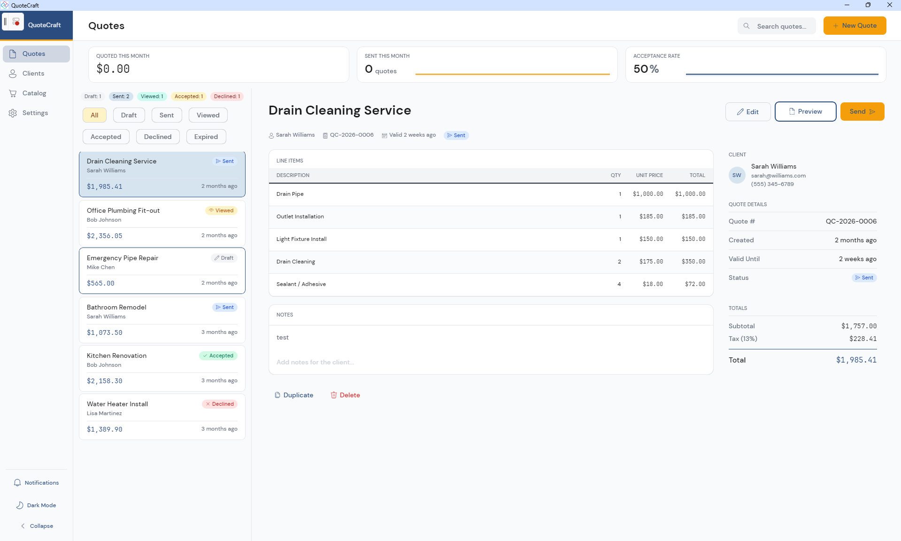

# 🧾 QuoteCraft — *Quotes, done in one app*

> A professional quoting and invoicing app for contractors and small trades: create quotes, manage clients, generate branded PDFs, track acceptance.




## What you get
The most product-complete sample in the set — a real **SQLite + QuestPDF** workflow with onboarding, a service catalog, and dashboard analytics, all on MVUX.

## Highlights
- **Quote management** — create, edit, duplicate, and track quotes through Draft → Sent → Viewed → Accepted / Declined / Expired.
- **Client directory + service catalog** — searchable clients with quote history; services/materials grouped by trade with preset pricing.
- **PDF generation** (QuestPDF) and **email send**, plus **dashboard analytics** with sparkline charts (monthly totals, send counts, acceptance rate).
- **Responsive layout** — side rail on desktop, bottom tab bar on mobile; **dark mode** toggle.
- **Guided onboarding** for first-run business-profile setup.

## Stack & platforms
**MVUX** + region nav · SQLite (Microsoft.Data.Sqlite) · QuestPDF · Uno.Sdk 6.5 · `net10.0-desktop` ✅, `net10.0-android`, `net10.0-browserwasm`

## Run it
```powershell
dotnet run --project QuoteCraft/src/QuoteCraft/QuoteCraft.csproj -f net10.0-desktop
```
