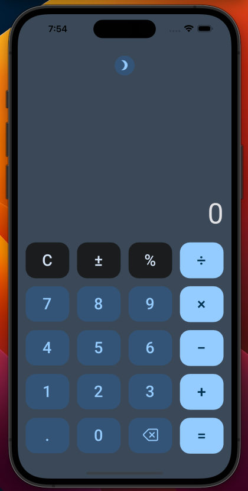

# SimpleCalc

The SimpleCalc App is a sample application that is designed to perform basic arithmetic operations. The app was built using the four variants of the [Simple Calc workshop](https://aka.platform.uno/simplecalc-workshop), combining markup language (XAML or C# Markup) and presentation framework (MVVM or MVUX).

## Learn More
- [C# Markup](https://aka.platform.uno/csharp-markup) 
- [MVUX](https://aka.platform.uno/mvux)