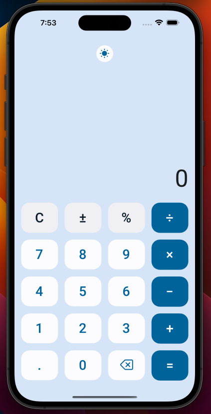

# Simple Calculator

The Simple Calc workshop is here to help you get started building an app for Desktop, Mobile, and Web with Uno Platform. This workshop is designed to help you get your developer environment set up to start building your first app, while learning about the tools, libraries, and patterns that will help you to build your apps with the Uno Platform.

This app was developed using Uno Platform and draws inspiration from [@adolfomarinucci's](https://x.com/adolfomarinucci) [Calculator project.](https://github.com/adospace/reactorui-maui/tree/main/samples/Calculator)

 

## Workshop

For a deeper understanding, you can also explore the [Simple Calc workshop](https://aka.platform.uno/simplecalc-workshop), where you'll be guided through the entire app creation process. Each module is accompanied by detailed explanations to ensure a comprehensive learning experience.