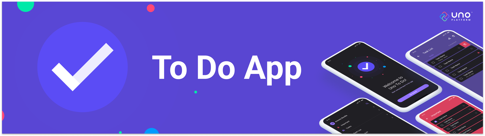
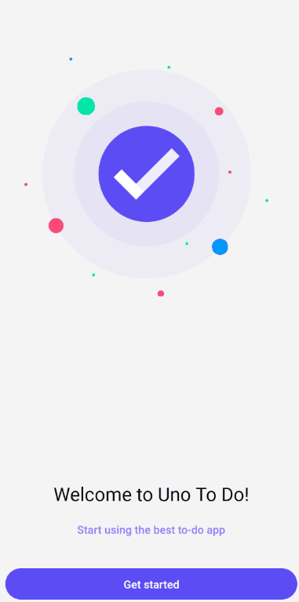

# ToDo App

  

Uno ToDo is a beautifully designed sample app for [Uno Platform](https://platform.uno/) using the latest [Material Design 3 system](https://m3.material.io/).

The design template makes it easy to jump-start or learn Uno Platform-powered mobile, web, and desktop applications. The app provides common functions such as logging on, recording tasks, adding due dates, setting reminders, and more.

In addition, the sample code utilizes [Uno.Extensions](https://aka.platform.uno/uno-extensions) and establishes the best practices for cross-platform application design and development considering multiple screen sizes, accessibility, enforcing brand guidelines, and more.

## Codebase

* [**WelcomeModel.cs**](src/ToDo/Presentation/WelcomeModel.cs) accessing tokens with Authentication.
* [**TaskListModel.cs**](src/ToDo/Presentation/TaskListModel.cs) common Navigation methods.
* [**HomeModel.cs**](src/ToDo/Presentation/HomeModel.cs) changing the language with Localization via the model.
* [**TaskListPage.xaml**](src/ToDo/Views/TaskListPage.xaml) adapting the language in the Xaml with Localization via `x:Uid`.
* [**SettingsModel.cs**](src/ToDo/Presentation/SettingsModel.cs) theme switching with ThemeService.
* [**TaskListModel.cs**](src/ToDo/Presentation/TaskListModel.cs) Reactive ListFeeds with [**TaskListPage.xaml**](src/ToDo/Views/TaskListPage.xaml) FeedViews.

## What is the Uno Platform

[Uno Platform](https://platform.uno) is an open-source .NET platform for building single codebase native mobile, web, desktop, and embedded apps quickly.
For additional information about Uno Platform or if you have any feedback to share, please refer to the [README.md](../../README.md) file in this Samples repository.