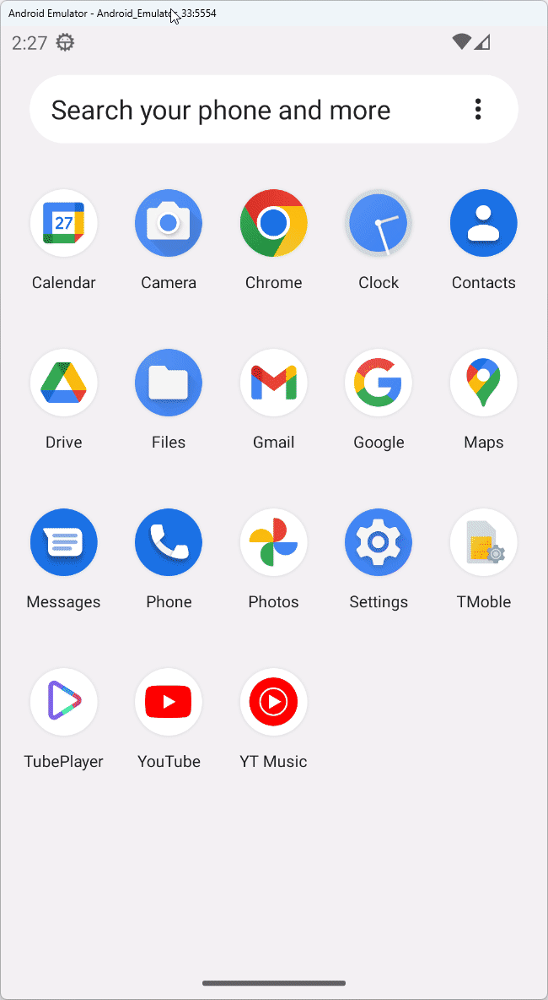

# TubePlayer

TubePlayer is a simple application that allows you to search for and watch YouTube videos. It consists of a search page where you can input your query and see matching results from YouTube, and a player page with a media player to stream the selected video.



Built with Uno Platform, TubePlayer uses [C# Markup](https://aka.platform.uno/csharp-markup) for the user interface and [MVUX](https://aka.platform.uno/mvux) for state management. This app serves as a demonstration of how to connect with external services using Configuration and Http in Uno Platform applications.

## Getting Started

1. **YouTube API Key**: Obtain your OpenAI API key by visiting [https://developers.google.com/youtube/v3/getting-started](https://developers.google.com/youtube/v3/getting-started).

2. **Update Configuration**: Under the project, open the file appsettings.development.json (cascaded under appsettings.json in Visual Studio Solution Explorer) and replace the "your_development_api_key" placeholder with your API Key:

```json
...
"YoutubeEndpoint": {
    "Url": "https://youtube.googleapis.com/youtube/v3",
    "ApiKey": "your_development_api_key",
    "UseNativeHandler": true
    },
...
```

## Techniques and controls used in this sample

The TubePlayer app utilizes the latest Uno Platform features, including:

<!-- TODO: Use aka links -->

- [C# Markup](https://aka.platform.uno/csharp-markup)
- [Extensions](https://platform.uno/docs/articles/external/uno.extensions/doc/ExtensionsOverview.html)
  - [MVUX](https://aka.platform.uno/mvux)
  - [Configuration](https://aka.platform.uno/docs/articles/external/uno.extensions/doc/Learn/Configuration/ConfigurationOverview.html)
  - [Http](https://aka.platform.uno/docs/articles/external/uno.extensions/doc/Learn/Http/HttpOverview.html)
- [Figma plugin](https://aka.platform.uno/uno-figma)
- [Color overrides](https://aka.platform.uno/docs/articles/external/uno.themes/doc/material-getting-started.html#manual-color-overrides)
- [DSP import](https://aka.platform.uno/docs/articles/external/uno.themes/doc/material-dsp.html)
- [Material design theme](https://aka.platform.uno/docs/articles/external/uno.themes/doc/material-getting-started.html)
- [Toolkit](https://aka.platform.uno/docs/articles/external/uno.toolkit.ui/doc/getting-started.html)
- [Resizetizer](https://aka.platform.uno/docs/articles/external/uno.resizetizer/doc/using-uno-resizetizer.html)

## Workshop

For a deeper understanding, you can also explore the [TubePlayer Workshop](https://aka.platform.uno/tubeplayer-workshop), where you'll be guided through the entire app creation process. Each module is accompanied by detailed explanations to ensure a comprehensive learning experience.
