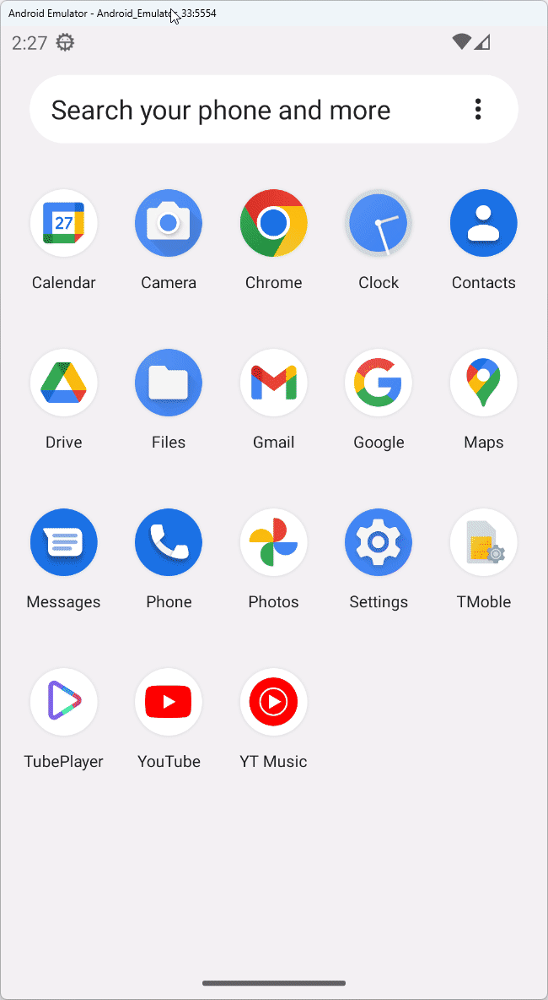

# TubePlayer

TubePlayer is a simple application that allows you to search for and watch YouTube videos. It consists of a search page where you can input your query and see matching results from YouTube, and a player page with a media player to stream the selected video.

Built with Uno Platform, TubePlayer utilizes C# Markup for the user interface and MVUX for state management. This app serves as a demonstration of how to connect with external services using Configuration and Http in Uno Platform applications.

## Getting Started

<!-- TODO -->

## Codebase

<!-- TODO -->

## Reference

<!-- TODO: Add MVUX and C# Markup docs links and TubePlayer Workshop link -->